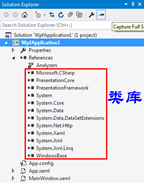
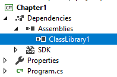
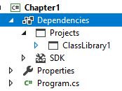

# C# Introduction

- [C# Introduction](#c-introduction)
    - [引用类库](#%E5%BC%95%E7%94%A8%E7%B1%BB%E5%BA%93)
        - [dll引用（闭源，黑盒引用）](#dll%E5%BC%95%E7%94%A8%EF%BC%88%E9%97%AD%E6%BA%90%EF%BC%8C%E9%BB%91%E7%9B%92%E5%BC%95%E7%94%A8%EF%BC%89)
        - [项目引用（开源，白盒应用）](#%E9%A1%B9%E7%9B%AE%E5%BC%95%E7%94%A8%EF%BC%88%E5%BC%80%E6%BA%90%EF%BC%8C%E7%99%BD%E7%9B%92%E5%BA%94%E7%94%A8%EF%BC%89)
    - [Property, Method, Event](#property-method-event)

编程的学习路径：看书、看文档、写代码、google

- 纵向：语言→类库→框架(有一定组织逻辑的类库，类库的best practice最佳组合方案)
- 横向：command line, desktop, phone, web, game

IDE(集成开发环境)：编辑，编译，调试，发布

```csharp
namespace WpfApp1 {
    /// <summary>
    /// Interaction logic for MainWindow.xaml
    /// </summary>
    public partial class MainWindow : Window {
        public MainWindow() {
            InitializeComponent();
        }

        private void Button_Click(object sender, RoutedEventArgs e) {
            this.myText.Text = "Hello, wpf";
        }
    }
}
```

Reference:

- MSDN
- C# language specification(安装路径\VC#\Specifications\1033)
- C# in a nutshell(recommended)
- [programming-guide](https://docs.microsoft.com/en-us/dotnet/csharp/programming-guide/)
- [language-reference](https://docs.microsoft.com/en-us/dotnet/csharp/language-reference/)

编程的捷径:

- 从感观到原理
- 从使用别人的到创建自己的
- 必须亲自动手(编程是练出来的)
- 必须学以致用，紧跟实际应用
- 追求实用，不搞“学院派”

Solution vs Project:

- Solution:总的解决方案
- Project:解决具体某个问题

Tips:

- `Shift` + `Enter`：Autocomplete Semicolon
- `Ctrl` + `.`:智能提示

```csharp
//winform
namespace WindowsFormsApp1 {
    public partial class Form1 : Form {
        public Form1() {
            InitializeComponent();
        }

        private void button1_Click(object sender, EventArgs e) {
            this.label1.Text = "Hello,worldl";
        }
    }
}
```

class & namespace 放在类库里面:

- class构成程序的主体(类名首字母大写)
- namespace以树型结构组织类（其他类型）

类库引用:

- Dll引用（黑盒引用）
- 项目引用（白盒引用）

class与class之间，类库与类库之间，一旦相互引用，就会有“依赖关系”，尽量使用弱依赖关系(高内聚，低耦合)，通过UML图来分析class与class关系

```csharp
using System;

namespace Chapter1
{
    class Program
    {
        static void Main(string[] args)
        {
            Console.WriteLine("Hello World!");
            System.Console.Write("Good Morning");//去掉using System;仍然有效，因为已经引用了mscorlib.dll
        }
    }

    class MyClass {

    }
}
```



## 引用类库

### dll引用（闭源，黑盒引用）

- Project右击/Add References/*.dll

- Nuget技术（批量的引入类库（因为类库之间有依赖关系））

    Project右击/Manager Nuget Package

    e.g. Entity Framework类库包（包含各种类库），用于数据库talbe与csharp的class映射



```csharp
//use Classlibrary.dll
using System;

namespace Chapter1
{
    class Program
    {
        static void Main(string[] args)
        {
            Console.WriteLine(ClassLibrary1.Class1.myAdd(12.3,10.0));
        }
    }
}
```

### 项目引用（开源，白盒应用）

- 一个project可以被多个solution包含：project右击/Add Exiting Project 选择其他人写好的Solution
- 如果是引用其他人的类库，在上面的基础上,右击/Add References/Projects
- 排除错误，点击出现问题的“行”，Start Debugging，F11（step into）进入别人的project出现问题的地方
- 找错误的时候要找Root Cause



```csharp
//ClassLibrary1 project
using System;

namespace ClassLibrary1
{
    public class Class1
    {
        public static double myAdd(double a,double b) {
            return a + b;
        }

        public static double myDiv(double a,double b) {
            if (b==0) {
                return double.PositiveInfinity;
            }
            else {
                return a / b;
            }
        }
    }
}
```

```csharp
//use the classlibrary1 project
using System;

namespace Chapter1
{
    class Program
    {
        static void Main(string[] args)
        {
            Console.WriteLine(ClassLibrary1.Class1.myAdd(12.3,10.0));
        }
    }
}
```

class vs instance(object):

“对象”＝“实例”，class实例化就成为实例，逻辑上叫做对象，内存中叫做实例，其实都是一回事。

- 比如拿数学家类创建一个数学家对象，而内存中的数学家对象叫做数学家实例

有些class不能实例化，比如math(抽象的类)；但是数学家却可以实例化

`new`操作符创建实例（instance），`()`是constructor(表示在内存中如何进行初始化)

- `(new Form()).ShowDialog();`其中`new Form()`就是一个实例

引用变量和实例:

- 声明引用变量(`Form myForm;`)，这样才能连续操作一个实例

```csharp
//有引用变量myForm，才能连续操作一个实例
Form myForm;
myForm=new Form();
//
myForm.Text="Another Title";
myForm.ShowDialog();
```

```csharp
//error
(new Form()).Text="Another Title";//第一个实例
(new Form()).ShowDialog();//第二个实例
```

## Property, Method, Event

Property: 存储数据，表示class或者instance当前的状态

Method:

Event: Class, instance通知其他class, instance的机制(C#特有(非必需，容易被滥用),Java是其他机制)。Qt中是SLOT,SIGNAL机制

visual中的class用水蓝色标记，查看MSDN，光标放在class上面，F1; 为了解决一个问题，大致确定它会用到的class, 然后在MSDN上面搜，看该class的最开头一句话，然后看remark，了解该class最常用的成员

有些class进化出Property发达的class(entity framework的类)，另外一些进化出method发达一些的(Math类)，还有一些event比较发达(timer类)

```csharp
//Need Entityframework,Entityframework只能用于.net framework,不能用于.Net core
//连接之后会有一个Medel
AdventureWorksLT2012Entities proxy=new AdventureWorksLT2012Entities();
foreach(Product p in proxy.Products)
{
    Console.Writeline(p.Name);
}
Console.Writeline(proxy.Products.Count());
```

```csharp
//Math
double x1=Math.Sqrt(4);//2
double x2=Math.Pow(2,3);//8
```

```csharp
//Timer
//要using这个
using System.Windows.Threading;

namespace WpfApp1 {
    /// <summary>
    /// Interaction logic for MainWindow.xaml
    /// </summary>
    public partial class MainWindow : Window {
        public MainWindow() {
            InitializeComponent();
            //
            DispatcherTimer myTimer = new DispatcherTimer();
            myTimer.Interval = TimeSpan.FromSeconds(1);
            myTimer.Tick += MyTimer_Tick;
            myTimer.Start();
        }

        private void MyTimer_Tick(object sender, EventArgs e) {
            this.Title = DateTime.Now.ToString();
        }
    }
}
```

Class的“静态（static）成员”与“实例（none static）成员”

- Static语义上表示它是“class的成员
- 实例成员语义上表示它是“对象的成员”

Binding表示编译器把一个成员与class还是instance关联起来