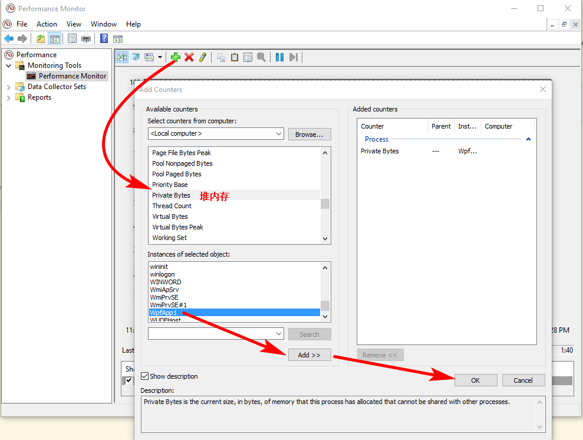
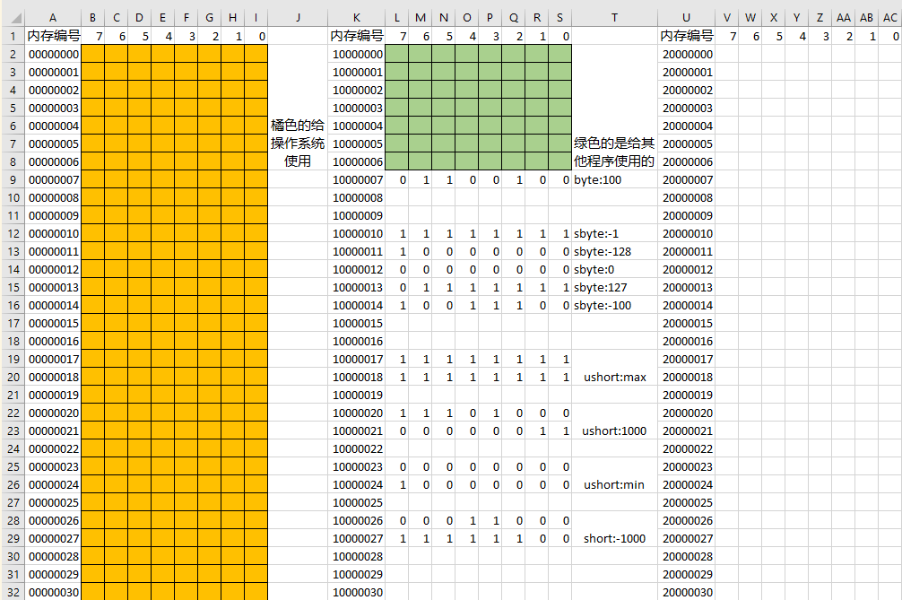
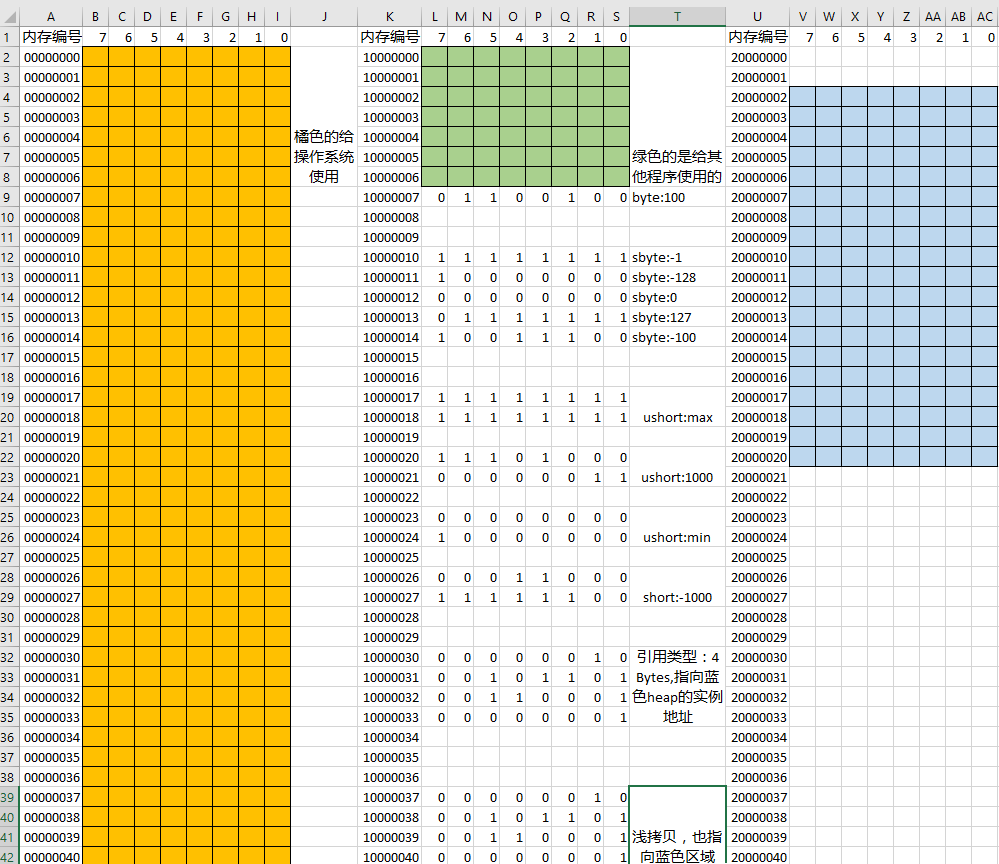

# Type, Variable, Object

<!-- TOC -->

- [Type, Variable, Object](#type-variable-object)
    - [C# 基本元素、类型、变量、方法](#c-基本元素类型变量方法)
        - [C# keyword](#c-keyword)
        - [C# identifier](#c-identifier)
        - [C# 文本(字面值)](#c-文本字面值)
        - [C# 注释、空白](#c-注释空白)
        - [C# 类型](#c-类型)
    - [Type, Variable, Object in Details](#type-variable-object-in-details)
        - [Type](#type)
        - [C#类型包含的6个信息](#c类型包含的6个信息)
        - [C#的类型系统](#c的类型系统)
            - [C#五大数据类型](#c五大数据类型)
            - [C#类型的派生谱系](#c类型的派生谱系)
    - [C# 变量](#c-变量)
        - [C# 7种变量](#c-7种变量)
    - [Reference Type & Value Type](#reference-type--value-type)
        - [Vaule Type](#vaule-type)
        - [Reference Type](#reference-type)
        - [boxing & unboxing(装箱&拆箱)](#boxing--unboxing装箱拆箱)

<!-- /TOC -->

## C# 基本元素、类型、变量、方法

构成C#的基本元素

$$
\text{标记}(token)\begin{cases}
    Keyword\\
    Operator\\
    Identifier\begin{cases}
    \text{合法性}\\
    \text{大小写规范}\\
    \text{命名规范}
\end{cases}\\
    \text{标点符号}\\
    \text{文本}(\text{字面值})\begin{cases}
    \text{整数}\\
    \text{实数}\\
    \text{字符}\\
    \text{字符串}\\
    bool\\
    \text{空}(null)
\end{cases}
\end{cases}
$$

$$
\text{注释、空白(不属于token)}\begin{cases}
    \text{单行注释}\\
    \text{多行注释}
\end{cases}
$$

### C# keyword

[C#-keyword](https://docs.microsoft.com/en-us/dotnet/csharp/language-reference/keywords/)

学习关键字按照MSDN的逻辑分组来学

[reference-index](https://docs.microsoft.com/en-us/dotnet/csharp/language-reference/index)

### C# identifier

合法性：

- 不能和keywords冲突
- 字母、数字、下划线(不能数字开头)
- 可以是中文

大小写规范：

- 骆驼命名法 e.g. `int myVariable;` C#中变量名这么干(Java的方法用的是骆驼法)
- Pascal法 e.g. `class MyClass{}` C#中方法名、Class、namespace这么干

命名规范:

- class命名的时候，最好用名词或者名词复数
- class的成员property最好用名词或者名词复数
- class的成员method最好用动词或者动词短语

### C# 文本(字面值)

```csharp
//integer
int x1=100;//4Bytes,default
long x20=100l;//8Bytes
long x2=100L;//8Bytes

//float
float x30=10.0f;//4Bytes
float x3=10.0F;//4Bytes
double x4=12.3;//8Bytes,default

//char & string
char ch='a';
string s="grey";

//bool
bool b1=true;
bool b2=false;

//null
string str=null;//没有引用任何东西
Form myForm=null;
```

### C# 注释、空白

块注释不能嵌套，单行注释比块注释优先级高

```csharp
//This is a comment

/*This is
a block
comment*/
```

多个空格来间隔文本，恢复一个空格的状态（edit/Advanced/Format Document）Ctrl+E,D

### C# 类型

Type(或者Data Type)

```csharp
//Tyep example
using System;

namespace ConsoleApp1
{
    class Program
    {
        static void Main(string[] args)
        {
            var x1 = 100;
            var x2 = 100l;
            var x3 = 100L;

            var y1 = 111.2;
            var y2 = 111.2f;
            var y3 = 111.2F;

            var z1 = 'a';
            var z2 = "James";

            var b1 = true;
            var b2 = false;

            Console.WriteLine(x1.GetType().Name);
            Console.WriteLine(x2.GetType().Name);
            Console.WriteLine(x3.GetType().Name);
            Console.WriteLine(y1.GetType().Name);
            Console.WriteLine(y2.GetType().Name);
            Console.WriteLine(y3.GetType().Name);
            Console.WriteLine(z1.GetType().Name);
            Console.WriteLine(z2.GetType().Name);
            Console.WriteLine(b1.GetType().Name);
            Console.WriteLine(b2.GetType().Name);
        }
    }
}
```

```bash
#output
Int32
Int64
Int64
Double
Single
Single
Char
String
Boolean
Boolean
```

```csharp
//functin example
using System;

namespace ConsoleApp1
{
    class Program
    {
        static void Main(string[] args)
        {
            MyClass my1 = new MyClass();
            Console.WriteLine(my1.myToday());//8
        }
    }

    class MyClass {
        public string myToday() {
            return DateTime.Now.Day.ToString();
        }
    }
}
```

```csharp
//print
//x,x-1,....2,1
using System;

namespace ConsoleApp2
{
    class Program
    {
        static void Main(string[] args)
        {
            MyClass my1 = new MyClass();
            my1.PrintXTo1(10);
            Console.WriteLine();
            my1.PrintXTo1Recursive(10);
        }
    }

    class MyClass {

        //loop
        public void PrintXTo1(int x) {
            for (int i = x; i > 0; i--) {
                Console.Write(i+" ");
            }
        }
        //recursive
        public void PrintXTo1Recursive(int x) {
            if (x==1) {
                Console.WriteLine(x);
            }
            else {
                Console.Write(x+" ");
                PrintXTo1Recursive(x - 1);
            }
        }
    }
}
```

```bash
#output
10 9 8 7 6 5 4 3 2 1
10 9 8 7 6 5 4 3 2 1
```

```csharp
//1+2+3+...+X
using System;

namespace ConsoleApp3
{
    class Program
    {
        static void Main(string[] args)
        {
            MyClass my1 = new MyClass();
            Console.WriteLine(my1.SumFrom1ToX(100));//5050
            Console.WriteLine(my1.SumFrom1ToXRecursive(100));//5050
            Console.WriteLine(my1.SumFrom1ToXFormula(100));//5050
        }
    }

    class MyClass {
        public int SumFrom1ToX(int x) {
            //loop
            int res = 0;
            for (int i = 0; i <= x; i++) {
                res += i;
            }
            return res;
        }

        public int SumFrom1ToXRecursive(int x) {
            //recursive，内存多
            if (x==1) {
                return 1;
            }
            else {
                return x + SumFrom1ToXRecursive(x - 1);
            }
        }

        public int SumFrom1ToXFormula(int x) {
            return (1 + x) * x / 2;//一定可除,算法复杂度最低
        }
    }
}
```

```csharp
//hanoi
using System;

namespace ConsoleApp1
{
    class Program
    {
        static void Main(string[] args)
        {
            move(3, 'A', 'B', 'C');
        }

        static void move(int n, char a, char b, char c) {
            //Program不会创建instance,所以只能是static函数
            if (n == 1) {
                Console.WriteLine($"Move {a} To {c}");
            }
            else {
                move(n - 1, a, c, b);
                Console.WriteLine($"Move {a} To {c}");
                move(n - 1, b, a, c);
            }
        }
    }
}
```

## Type, Variable, Object in Details

### Type

又名Data Type

- A data type is a homogeneous collection of values, effectively presented, equipped with a set of operations which manipulate thses values.
- 是数据在内存中存储时的“型号”

强类型编程语言：受到数据类型的约束很严格(C++,C#)，保证数据的完整性和安全性

弱类型编程语言：受到数据类型的约束不严格(C弱,JavaScript很弱)

```csharp
//Convert.ToInt32
Console.WriteLine(Convert.ToInt32(1000L));//1000
Console.WriteLine(Convert.ToInt32(12.3F));//12
Console.WriteLine(Convert.ToInt32(15.3));//15
Console.WriteLine(Convert.ToInt32("123"));//123
Console.WriteLine(Convert.ToInt32('A'));//65
Console.WriteLine(Convert.ToInt32(true));//1
Console.WriteLine(Convert.ToInt32(false));//0
//(int)
Console.WriteLine((int)999L);//999
Console.WriteLine((int)12.3F);//12
Console.WriteLine((int)15.3);//15
Console.WriteLine((int)'A');//65
//ToString
int x1 = 100;
long x2 = 99L;
float y1 = 12.3F;
double y2 = 13.6;
char ch = 'A';
bool b1 = true;
bool b2 = false;
Console.WriteLine(x1.ToString());//100
Console.WriteLine(x2.ToString());//99
Console.WriteLine(y1.ToString());//12.3
Console.WriteLine(y2.ToString());//13.6
Console.WriteLine(ch.ToString());//A
Console.WriteLine(b1.ToString());//True
Console.WriteLine(b2.ToString());//False
```

```csharp
//csharp这是非法的；c/c++确可以，容易出错
int x = 100;
if (x=200) {
    Console.WriteLine("OK");
}
```

```javascript
<script>
  function ButtonCicked(){
      //javascript的动态类型
      var myVar=100;
      alert(myVar);//messagebox
      myVar="Hello, Grey";
      alert(myVar);//messagebox
}
</script>
```

C#在4.0之后可以对弱类型/动态类型模仿:`dynamic`; C#的`var`用于推断

```csharp
//和底层打交道的时候，可以发挥强大的功能
dynamic myVar = 100;
Console.WriteLine(myVar);//100
myVar = "Hello, Grey";
Console.WriteLine(myVar);//Hello,Grey
```

### C#类型包含的6个信息

[Types](https://docs.microsoft.com/en-us/dotnet/csharp/language-reference/keywords/types)

- 存储此类型变量所需的内存空间大小
- 此类型的值的最小、最大的范围
- 此类型所包含的成员（property, method, event）。对程序有两大用处：静态用处，动态用处
  - 对于一个程序来讲，静态就是它的编辑器、编译期；动态就是它的调试、运行期
  - 静态用处：编译的时候，如果检查出不包含某个成员，直接报错，编译不通过
  - 动态用处：C#反射。程序运行过程中，拿到一个类型或者instance可以知道它的成员；如果拿到属性成员，那么就可以访问属性的值，拿到method成员就可以动态调用method
- 此类型由何“基类”（“父类”）派生而来(知道在继承链的位置)
  - 也是用于reflection(略)
- 程序运行时，此类型变量分配在内存什么位置
  - Stack：给方法调用来用的，比较小（几M）
  - Stack Overflow原因：函数调用太多；在stack上分配太多内存
  - Heap：存储对象用的，比较大（几G），实例就放在heap中
  - 内存泄露：Heap没有回收对象，造成内存浪费
  - C++没有回收，会出现内存泄露；C#有一个垃圾收集器(GC)
  - 实例是分配在Heap里面，变量根据类型有的分配在Stack里面，有的分配在Heap里面
- 此类型所允许的操作

```csharp
//C# reflection,类型动态用处
using System;
using System.Reflection;

namespace ConsoleApp2
{
    class Program
    {
        static void Main(string[] args)
        {
            Type myType = typeof(MyClass);
            Console.WriteLine(myType.Name);//MyClass
            Console.WriteLine(myType.FullName);//ConsoleApp2.MyClass
            Console.WriteLine(myType.BaseType.Name);//Object
            Console.WriteLine(myType.BaseType.FullName);//System.Object
            //
            Console.WriteLine();
            PropertyInfo[] pInfos = myType.GetProperties();
            foreach (var item in pInfos) {
                Console.WriteLine(item);
            }
            //
            Console.WriteLine();
            foreach (var item in myType.GetProperties()) {
                Console.WriteLine(item.Name);
            }
            //
            Console.WriteLine();
            //不使用
            //MethodInfo[] mInfos = myType.GetMethods();
            foreach (var item in myType.GetMethods()) {
                Console.WriteLine(item);
            }
            Console.WriteLine();
            foreach (var item in myType.GetMethods()) {
                Console.WriteLine(item.Name);
            }
        }
    }

    class MyClass {
        public int ID { get; set; }
        public string Name { get; set; }
        public void Report() {
            Console.WriteLine($"ID={ID},Name={Name}.");
        }
    }
}
```

```bash
#output
MyClass
ConsoleApp2.MyClass
Object
System.Object

Int32 ID
System.String Name

ID
Name

Int32 get_ID()
Void set_ID(Int32)
System.String get_Name()
Void set_Name(System.String)
Void Report()
System.String ToString()
Boolean Equals(System.Object)
Int32 GetHashCode()
System.Type GetType()

get_ID
set_ID
get_Name
set_Name
Report
ToString
Equals
GetHashCode
GetType
```

```csharp
//stackoverflow by Recursive
using System;

namespace ConsoleApp3
{
    class Program
    {
        static void Main(string[] args)
        {
            BadGuy my1 = new BadGuy();
            my1.BadMethod();
        }
    }

    class BadGuy {
        public void BadMethod() {
            //stack-overflow by Recursive
            this.BadMethod();
        }
    }
}
```

```csharp
//C#使用指针Method1
//右键Project/Property/Build/Allow unsafe code
using System;

namespace ConsoleApp4
{
    class Program
    {
        static void Main(string[] args)
        {
            unsafe {
                int* p = stackalloc int[10];
                for (int i = 0; i < 10; i++) {
                    p[i] = i;
                }
                for (int i = 0; i < 10; i++) {
                    Console.Write(p[i]+" ");
                }
            }
        }
    }
}
```

```csharp
//C#使用指针Method2
//右键Project/Property/Build/Allow unsafe code
using System;

namespace ConsoleApp5
{
    class Program
    {
        static void Main(string[] args)
        {
            go();
        }

        static unsafe void go() {
            int* p = stackalloc int[10];
            for (int i = 0; i < 10; i++) {
                p[i] = i;
                Console.Write(p[i]+" ");
            }
        }
    }
}
```

```csharp
//stackoverflow by 在stack分配太多内存
using System;

namespace ConsoleApp4
{
    class Program
    {
        static void Main(string[] args)
        {
            unsafe {
                int* p = stackalloc int[1024*1024];//4M
            }
        }
    }
}
```

process: 一个程序从硬盘加载到内存(从静态到动态)，形成一个进程(program的instance)

可以cmd的`perfmon`



```csharp
//挤爆heap
//wpf example
public partial class MainWindow : Window {
        public MainWindow() {
            InitializeComponent();
        }

        List<Window> myList;
        private void Button_Click(object sender, RoutedEventArgs e) {
            myList = new List<Window>();
            for (int i = 0; i < 15000; i++) {
                Window w = new Window();
                myList.Add(w);
            }
        }

        private void Button_Click_1(object sender, RoutedEventArgs e) {
            myList.Clear();
        }
    }
```

Build将自己compile的assembly和别人的assemble装配在一起, Build产生`.exe` or `.dll`

### C#的类型系统

#### C#五大数据类型

C#各种各样的类型归为以下几类：

1. class, 如`Windows`, `Form`, `Console`, `String`,`string`,`object`
1. struct, 如`Int32`, `Int64`, `Single`, `Double`,`bool`
1. enum, 如`FormWindowState`, `Visibility`
1. interface,
1. delegate,

通过F12（右击/go to definition）查看某个单词的数据类型

`class`声明类，`struct`声明结构体，`enum`声明枚举

`class`, `interface`, `delegate`不是具体的数据类型，是为了定义数据类型，F12无法跳转; vs中class,interface,delegate是蓝色的(不可F12)，Form,Int32,FormwindowState是水蓝色的(可F12)

#### C#类型的派生谱系

$$
Object\begin{cases}
	ValueType\begin{cases}
	struct\\
	enum
\end{cases}\\
	ReferenceType\begin{cases}
	class\\
	interface\\
	delegate
\end{cases}
\end{cases}
$$

```csharp
//判断是否是class
//Method1: F1
//Method2: F12
//Method3: 下面
using System;

namespace ConsoleApp1
{
    class Program
    {
        static void Main(string[] args)
        {
            Type myType = typeof(MyClass);
            Console.WriteLine(myType.FullName);//ConsoleApp1.MyClass
            Console.WriteLine(myType.Name);//MyClass
            Console.WriteLine(myType.IsClass);//True
        }
    }

    class MyClass {

    }
}
```

`int`,`long`分别都是结构体`Int32`,`Int64`,因为太常见，C#吸收为关键字了

`object`,`string`分别是类`Object`,`String`,因为太常见，C#吸收为关键字了

```csharp
public enum FormWindowState{
    Normal=0,
    Minimized=1,
    Maximized=2,
}
```

## C# 变量

表面上看，变量的用途是存储数据；实际上，变量表示了**存储位置**，**类型**

- 变量名表示变量在内存中的存储位置
- 变量类型表示什么样的值能够存入

变量=以变量名所对应的内存地址为起点、以其数据类型所要求的存储空间为长度的内存空间

```csharp
short s = 100;
int x = s;//小数据存入大房子，可以implicti转换
```

### C# 7种变量

1. 静态变量(静态成员变量)
1. 实例变量(成员变量、字段),为了防止乱改字段，演化出属性
1. 数组元素
1. 值参数
1. 引用参数
1. 输出变量
1. 局部变量:函数体中的变量

格式：`有效的修饰符组合opt+类型+变量名+初始化器opt`

```csharp
public static int Amount;//静态成员变量
public int Age;//实例变量
public int[] Array;//数组
```

```csharp
static void Main(string[] args)
        {
            int res=0;//局部变量
            int[] myArray = new int[10];
            for (int i = 0; i < 10; i++) {
                myArray[i] = i;
                res += i;
            }
            Console.WriteLine(myArray[5]);//5
            Console.WriteLine(res);//45
        }
```

```csharp
using System;

namespace ConsoleApp2
{
    class Program
    {
        static void Main(string[] args)
        {
            MyClass my1 = new MyClass();
            Console.WriteLine(my1.myAdd(10,20.5));//30.5

            double a = 20;
            double b = 30;
            Console.WriteLine(my1.mySub(ref a,ref b));//-10
            double res = 0;
            my1.myDiv(10, 20.0, out res);
            Console.WriteLine(res);//0.5
        }
    }

    class MyClass {
        public double myAdd(double a, double b) {//值参数
            return a + b;
        }

        public double mySub(ref double a, ref double b) {//引用参数
            return a - b;
        }

        public void myDiv(double a,double b,out double res) {//输出参数
            res = a / b;
        }

    }
}
```

## Reference Type & Value Type

局部变量在stack上面；一般实例变量(class成员变量)在heap上分配内存；

常量的初始化器不能省略，常量不可修改

### Vaule Type

值类型没有实例，变量和实例合二为一

内存中存储的都是补码，所以`byte`:0~255; `sbyte`:-128~127

超过一个Byte，高位存储在内存的高位上

```csharp
short s1 = 1000;
short s2 = -1000;
ushort u1 = 1000;
Console.WriteLine(Convert.ToString(s1,2));//1111101000
Console.WriteLine(Convert.ToString(s2,2));//1111110000011000
Console.WriteLine(Convert.ToString(u1,2));//1111101000
```



### Reference Type

引用类型变量(4Byte,看操作系统)与实例的关系：引用类型变量存储的是实例的内存地址；

一般情况下，引用类型变量在stack上面;实例在heap上面



```csharp
using System;

namespace ConsoleApp3
{
    class Program
    {
        static void Main(string[] args)
        {
            Student stu = new Student();//stu就是引用类型变量，在stack上，实例new Student()在heap上面
            Student stu2 = stu;//浅拷贝
            Console.WriteLine(stu.ID);//0
            Console.WriteLine(stu.Score);//0
            //C#实例变量的默认值都是全部bit被constructor刷成0，局部变量是不允许没有初始化而调用的
            int x;
            // Console.WriteLine(x);//这个不允许
        }
    }

    class Student {
        //共6Byte
        public uint ID;
        public ushort Score;
    }
}
```

### boxing & unboxing(装箱&拆箱)

常常出现在面试中，实际用不上(性能损失)

当obj发现引用的不是heap上的东西，而是stack上面的东西，那么先将stack上的变量放到heap上面,把heap上的该地址给obj(叫做boxing)

```csharp
static void Main(string[] args)
    {
        int x = 100;
        object obj = x;//boxing,object default is 4Byte
        int y = (int)obj;//unboxing
        Console.WriteLine(y);//100
    }
```