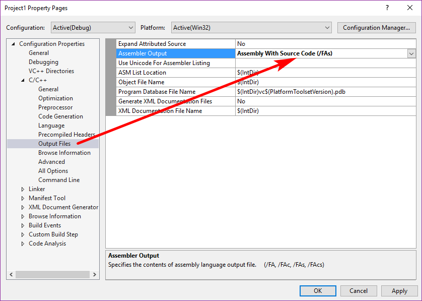

# C# Expression & Sentence

- [C# Expression & Sentence](#c-expression-sentence)
    - [Expression](#expression)
    - [Statement](#statement)
        - [C# 语句分类](#c-%E8%AF%AD%E5%8F%A5%E5%88%86%E7%B1%BB)
            - [block语句](#block%E8%AF%AD%E5%8F%A5)
            - [select语句](#select%E8%AF%AD%E5%8F%A5)
            - [try-statement](#try-statement)
    - [iteration-statement & jump-statement](#iteration-statement-jump-statement)
        - [`foreach`](#foreach)
    - [return-statement](#return-statement)
    - [Advanced statement](#advanced-statement)

## Expression

编程语言的表达式定义:

- Expressions, together with commands and declarations, are one of the basic components of every programming languages. We can say that expressions are the essential component of every language.
- An expression is a **syntactic entity** whose **evaluation** either **produces a value** or **failes to terminate**, in which case the expression is undefined.(专门用来求值(evaluate)得语法实体)

C#的表达式定义:

- An expression is a sequence of **one or more operands**  and **zero or more operators** that can be evaluated to a single value, object, method, or namespace.
- Expressions can consist of a literal value, a method invocation, an operator and its operands, or a simple name. Simple names can be the name of a variable, type member, method parameter, namespace or type.
- 表达式是构成算法逻辑的最小单元
- 因为操作符有优先级，表达式也有优先级

```csharp
using System;

namespace ConsoleApp1
{
    class Program
    {
        static void Main(string[] args)
        {
            int x;
            //x=100是表达式
            x = 100;//evaluate,得到的是single value
            x++;//evaluate,得到的是single value
            new MyClass();//evaluate,得到的是object;操作符是new,操作数是MyClass,()是调用ctor
            Action myAction = new Action(Console.WriteLine);//其中Console.WriteLine得到的是method；操作符是.，操作数是Console和WriteLine
            //引深一步可以得到class，namespace
            Console.WriteLine(typeof(Int64).FullName);//其中Int64为simple name
        }
    }

    class MyClass {

    }
}
```

C#表达式分类: 任何能够得到值的运算都是表达式，表达式不带`;`

- A value, Every value has an associate type. 表达式是有数据类型的，数据类型和oprand的数据类型不一定相同
- A variable, Every variable has an associate type
- A namespace
- A Type(比如`Int32`)
- A Method Group(比如`Console.WriteLine`拿到的是一组方法，后面的`()`才是调用)
- A `null` literal
- an anonymous function
- A property access
- An Event access
- An indexer access
- Nothing.对返回值为`void`方法的调用

`typeof(int)`: 的返回值是固定的，也就是`Type`类型；

`as`表达式，成功了返回的是右边的类型，失败表达式返回值为`null`

```csharp
var x = 5 > 3 ? 2 : 4.0;//:两边的必须能够进行implicit转换，并且表达式返回精度高的
Console.WriteLine(x.GetType().FullName);//System.Double
```

`=`表达式的值，就是赋值号左边的值；

```csharp
Action a = () => { Console.WriteLine("Hello"); };
a();//Hello

Func<int,int,int> f = (x,y) => { return x + y; };
Console.WriteLine(f(10, 20));//30
```

## Statement

通用的语句定义：

- In computer programming a statement is the smallest **standalone** element of an imperative programming language which express some **action** to be carried out. A program writtent in such a language is formed by a sequence of one or more statements. A statement will have internal components(e.g. expression)
- 语句是高级语言的语法--编译语言和机器语言只有指令(高级语言的表达式对应低级语言的指令)，**语句等价于一个或者一组有明显逻辑关联的指令**

C/C++不能反编译，但是可以反汇编(反汇编比反编译更加低级)；

c语言输出汇编代码:



C#查看汇编代码：StartMenu/VSTools/Development Command Prompt/ildasm

il:中间语言；dasm:反汇编

C#的语句定义:陈述算法思想、控制逻辑走向、完成有意义的动作(Action)

- 顺序表达思想，通过条件判断、跳转、循环等方法控制程序逻辑的走向

C#中语句以`;`结尾，以;结尾的不一定是语句, e.g. `using System;`是using指令不是语句；**语句一定是在方法体中**，不在方法体中，即便是以`;`结尾，都不是语句

```csharp
using System;

namespace ConsoleApp3
{
    class Program
    {
        static void Main(string[] args)
        {
            string input = Console.ReadLine();
            try {
                double score = double.Parse(input);
                if (score>=60) {
                    Console.WriteLine("Pass");
                }
                else {
                    Console.WriteLine("Failed");
                }

            }
            catch (Exception e) {

                Console.WriteLine(e.Message);
                Console.WriteLine("not a number");
            }
        }
    }

    class MyClass {
        public int ID;//这个是声明，不是语句
    }
}
```

### C# 语句分类

C#语句大类：

- labeled-statement
- declaration-statement
- embedded-statement(嵌入语句，能够嵌入到其他语句体中的语句，比如if里面能够嵌入if)

$$
C\#\ statement\begin{cases}
	labeled-statement\\
	declaration-statement\\
	embedded-statement\begin{cases}
	block\\
	empty-statement\\
	expression-statement\\
	selection-statement\\
	iteration-statement\\
	jump-statement\\
	try-statement\\
	checked-statement\\
	unchecked-statement\\
	lock-statement\\
	using-statement\\
	yield-statement
\end{cases}
\end{cases}
$$

`var`一旦推断出某个变量的类型，那么这个变量的类型就不能改变了;

expression-statement:表达式语句用于计算所给定的表达式，并且表达式的返回值被丢弃；

```csharp
//
int x;
x=100;//x=100这个表达的的返回值是100，但是表达式的返回值被丢弃了，然而x中保存了
```

```csharp
int x;
x=100;//这里没有初始化，后面赋值了

int x=100;//这里是初始化，不是赋值
```

Tips:尽量做到一个方法完成一件事情

```csharp
//反例，一个方法做了两件事情
static double myAdd(double a,double b) {
    double res = a + b;
    Console.WriteLine($"Result is {res}");
    return res;
}
```

```csharp
int x=100;
int y=200;
x+y;//在c,c++中允许如下语句存在，而C#不允许
x;//在c,c++中允许如下语句存在，而C#不允许
y;//在c,c++中允许如下语句存在，而C#不允许
x==1;//在c,c++中允许如下语句存在，而C#不允许
```

#### block语句

需要考虑变量的作用域；

所有语句(labeled,declaration,embedded statement)都可以放在块语句中

- 块语句既然是语句，那么它就只能出现在方法体中，不在方法体中的`{}`都不是块语句，而且方法体本身的括号也不是块语句
- 编译器永远吧块语句当做一条语句
- 编译器将块语句当作是完整的语句，也就是不用再末尾加`;`

```csharp
static void Main(string[] args)
{
    {
        int x = 5;//声明语句
        helllo: Console.WriteLine("Hello");//标签语句
        if (x > 10) goto helllo;//嵌入式语句
    }//这是一条块语句，无论里面有多少子语句
}
```

Tips: `Ctrl + }`在开始和结束`{}`之间跳转

程序的逻辑优化：代码重构(Code refactoring)

#### select语句

`switch`括号里面数据类型的必须是:sbyte, byte, short, ushort, int, uint, long, ulong, bool, char, string, enum-type；没有`float, double, decimal`

```csharp
//switch example
using System;

namespace ConsoleApp5
{
    class Program
    {
        static void Main(string[] args)
        {
            int x = 105;
            switch (x/10) {
                //case后面的必须是常量表达式(包含了常量值)
                case 10:
                    if (x==100) {
                        goto case 8;
                    }
                    else {
                        goto default;
                    }
                case 8:
                case 9:
                    Console.WriteLine("A");
                    break;
                case 6:
                case 7:
                    Console.WriteLine("B");
                    break;
                case 1:
                case 2:
                case 3:
                case 4:
                case 5:
                    Console.WriteLine("C");
                    break;
                default:
                    Console.WriteLine("Error number");
                    break;
            }
        }
    }
}
```

```csharp
//C# switch with enum, vs自动提示功能特别强大
using System;

namespace ConsoleApp6
{
    class Program
    {
        static void Main(string[] args)
        {
            MyEnum myLevel = MyEnum.Level3;
            switch (myLevel) {
                case MyEnum.Level1:
                    break;
                case MyEnum.Level2:
                    break;
                case MyEnum.Level3:
                    Console.WriteLine(myLevel);
                    break;
                case MyEnum.Level4:
                    break;
                case MyEnum.Level5:
                    break;
                case MyEnum.Level6:
                    break;
                default:
                    break;
            }
        }
    }

    enum MyEnum {
        Level1,
        Level2,
        Level3,
        Level4,
        Level5,
        Level6,
    }
}
```

#### try-statement

可以`>=0`个`catch`，但是`<=1`个`finally`；有一个通用的catch,也可以抓取特定type的Exception

Example: [Int32.Parse的Exception](https://docs.microsoft.com/en-us/dotnet/api/system.int32.parse?view=netframework-4.7.1#System_Int32_Parse_System_String_)

- `ArgumentNullException`
- `FormatException`
- `OverflowException`

```csharp
//通用的catch
using System;

namespace ConsoleApp7
{
    class Program
    {
        static void Main(string[] args)
        {
            myAdd("abc", "123");
            // myAdd("999999999999999999999", "123");
            // myAdd(null, "123");
        }

        static int myAdd(string str1,string str2) {
            int a = 0;
            int b = 0;
            try {
                a = int.Parse(str1);
                b = int.Parse(str2);
            }
            catch (Exception e) {

                Console.WriteLine(e.Message);
            }
            return a + b;
        }
    }
}
```

```csharp
//特定类型的catch
using System;

namespace ConsoleApp7
{
    class Program
    {
        static void Main(string[] args)
        {
            myAdd("abc", "123");
            // myAdd("999999999999999999999", "123");
            // myAdd(null, "123");
        }

        static int myAdd(string str1,string str2) {
            int a = 0;
            int b = 0;
            try {
                a = int.Parse(str1);
                b = int.Parse(str2);
            }
            catch (ArgumentNullException e) {//查MSDN看看Exception的种类
                Console.WriteLine(e.Message);
            }
            catch(FormatException e) {
                Console.WriteLine(e.Message);
            }
            catch(OverflowException e) {
                Console.WriteLine(e.Message);
            }
            return a + b;
        }
    }
}
```

```csharp
static int myAdd(string str1,string str2) {
    int a = 0;
    int b = 0;
    try {
        a = int.Parse(str1);
        b = int.Parse(str2);
    }
    catch(FormatException) {
        Console.WriteLine("Format Error");
    }

    return a + b;
}
```

Finally语句中写的内容:

- 释放系统资源的语句(比如打开数据库的连接，保证数据库正常关闭)
- 程序的log(下面的example)

```csharp
//finally log
using System;

namespace ConsoleApp7 {
    class Program {
        static void Main(string[] args) {
            myAdd("abc", "123");
            // myAdd("999999999999999999999", "123");
            // myAdd(null, "123");
        }

        static int myAdd(string str1, string str2) {
            int a = 0;
            int b = 0;
            bool hasError = false;
            try {
                a = int.Parse(str1);
                b = int.Parse(str2);
            }
            catch (ArgumentNullException e) {//查MSDN看看Exception的种类
                Console.WriteLine(e.Message);
                hasError = true;
            }
            catch (FormatException e) {
                Console.WriteLine(e.Message);
                hasError = true;
            }
            catch (OverflowException e) {
                Console.WriteLine(e.Message);
                hasError = true;
            }
            finally {
                if (hasError) {
                    Console.WriteLine("Some Error happens");
                }
            }
            return a + b;
        }
    }
}
```

`throw`的使用：

一个方法的内部只处理部分的Exception, 剩下的部分**throw**出去，给主调函数(caller)处理这个excetion

```csharp
using System;

namespace ConsoleApp7 {
    class Program {
        static void Main(string[] args) {
            try {
                myAdd("abc", "123");
            }
            catch (Exception e) {
                Console.WriteLine("Main is dealing ur exception");
                Console.WriteLine(e.Message);//主调函数处理Exception
            }
        }

        static int myAdd(string str1, string str2) {
            int a = 0;
            int b = 0;
            bool hasError = false;
            try {
                a = int.Parse(str1);
                b = int.Parse(str2);
            }
            catch (ArgumentNullException e) {//查MSDN看看Exception的种类
                Console.WriteLine(e.Message);
                hasError = true;
            }
            catch (FormatException e) {
                // throw e;//将e throw给主调函数，这里是Main
                throw;//for simplicity,甚至(FormatException e)可以改成(FormatException)
            }
            catch (OverflowException e) {
                Console.WriteLine(e.Message);
                hasError = true;
            }
            finally {
                if (hasError) {
                    Console.WriteLine("Some Error happens");
                }
            }
            return a + b;
        }
    }
}
```

```bash
#output
Main is dealing ur exception
Input string was not in a correct format.
```

## iteration-statement & jump-statement

C# iteration:

- `while`: $\geqslant0$次循环
- `do{} while`: $\geqslant1$次循环
- `for`: 计数循环
- `foreach`: 集合遍历

```csharp
//while example
static void Main(string[] args)
{
    int score = 0;
    bool canContinue = true;
    while (canContinue)
    {
        Console.WriteLine("Please input the first number");
        int a = int.Parse(Console.ReadLine());
        Console.WriteLine("Please input the second number");
        int b = int.Parse(Console.ReadLine());

        int sum = a + b;
        if (sum==100)
        {
            ++score;
            Console.WriteLine("{0}+{1}={2}",a,b,sum);
        }
        else
        {
            Console.WriteLine("{0}+{1}={2}",a,b,sum);
            canContinue = false;
        }

    }
    Console.WriteLine("Game Over");
    Console.WriteLine("Your Score is {0}", score);
}
```

```csharp
//do...while example
static void Main(string[] args)
{
    int score = 0;
    int sum = 0;
    do
    {
        Console.WriteLine("Please input the first number");
        int a = int.Parse(Console.ReadLine());
        Console.WriteLine("Please input the second number");
        int b = int.Parse(Console.ReadLine());

        sum = a + b;
        if (sum == 100)
        {
            ++score;
        }
        Console.WriteLine("{0}+{1}={2}", a, b, sum);
    } while (sum == 100);

    Console.WriteLine("Game Over");
    Console.WriteLine("Your Score is {0}", score);
}
```

```csharp
//continue example
static void Main(string[] args)
{
    int x = 0;
    int sum = 0;
    do
    {
        sum += x;
        ++x;
        if (x==3)
        {
            x = 5;
            continue;
        }
    } while (x<6);//1+2+5
    Console.WriteLine(sum);
}
```

```csharp
//a Game
static void Main(string[] args)
{
    int score = 0;
    bool canContinue = true;
    do
    {
        Console.WriteLine("Please input the first number");
        string str1 = Console.ReadLine();
        if (str1.ToLower()=="end")
        {
            break;
        }
        //for first number
        int a = 0;
        try
        {
            a = int.Parse(str1);
        }
        catch
        {
            Console.WriteLine("First Number has problem! Restart!");
            continue;
        }
        //for second number
        Console.WriteLine("Please input the second number");
        int b = 0;
        string str2 = Console.ReadLine();
        if (str2.ToLower()=="end")
        {
            break;
        }
        try
        {
            b = int.Parse(str2);
        }
        catch
        {
            Console.WriteLine("Second Number has problem!Restart!");
            continue;
        }
        //for sum
        int sum = a + b;
        if (sum == 100)
        {
            ++score;
            Console.WriteLine("{0}+{1}={2}", a, b, sum);
        }
        else
        {
            Console.WriteLine("{0}+{1}={2}", a, b, sum);
            canContinue = false;
        }
    } while (canContinue);

    Console.WriteLine("Game Over");
    Console.WriteLine("Your Score is {0}", score);
}
```

```csharp
//for example, 9x9 multiply formula
static void Main(string[] args)
{
    for (int i = 1; i < 10; i++)
    {
        for (int j = 1; j <= i; j++)
        {
            Console.Write($"{i}x{j}={i*j}\t");
            // Console.Write("*\t");//打印星星
        }
        Console.WriteLine();
    }
}
```

### `foreach`

C#中实现了`IEnumerable`interface的class就是可以被foreach遍历的集合

```csharp
using System;
using System.Collections.Generic;

namespace ConsoleApp1
{
    class Program
    {
        static void Main(string[] args)
        {
            int[] myArr = { 1, 2, 3, 4, 5, 6 };
            Console.WriteLine(myArr.GetType().FullName);//System.Int32[]
            Console.WriteLine(myArr is Array);//True,C#所有数组的基类都是Array,而Array实现了IEnumerable interface，所以所有的数组都能被foreach遍历
            //
            List<int> myList = new List<int>(){ 11, 22, 33, 44, 55 };//List<T>也实现了IEnumerable接口，所以也可以别迭代
        }
    }
}
```

```csharp
//IEnumerator
static void Main(string[] args)
{
    //IEnumerable接口里面只有一个GetEnumerator()方法
    int[] myArray = new int[] { 1, 2, 3, 4, 5, 6, 7, 8, 9 };
    List<double> myList = new List<double> { 1.2, 2.3, 3.4, 6.4 };
    IEnumerator myEnumberator1 = myArray.GetEnumerator();//因为实现了IEnumerable接口，所以都有GetEnumerator()方法
    IEnumerator myEnumberator2 = myList.GetEnumerator();
    //Array enumerating
    while (myEnumberator1.MoveNext())
    {
        Console.Write(myEnumberator1.Current+" ");
    }
    Console.WriteLine();//1 2 3 4 5 6 7 8 9
    myEnumberator1.Reset();
    //Array enumerating again
    while (myEnumberator1.MoveNext()) {
        Console.Write(myEnumberator1.Current + " ");
    }
    Console.WriteLine();//1 2 3 4 5 6 7 8 9
    //list enumerating
    while (myEnumberator2.MoveNext())
    {
        Console.Write(myEnumberator2.Current+" ");
    }
    Console.WriteLine();//1.2 2.3 3.4 6.4
}
```

```csharp
//foreach就是为了简化IEnumerator
int[] intArrary = new int[] { 1, 2, 3, 4, 5, 6, 7, 8, 9 };
foreach (var current in intArrary)
{
    Console.WriteLine(current);
}
```

## return-statement

- 尽早return
- method返回值不是void，而且涉及选择语句，则需要每一个选择都能够return

```csharp
//尽早return
class Program
{
    static void Main(string[] args)
    {
        Program p = new Program();
        p.Greeeting("Gewei");    //一般不这么干，应该让greeting成为static，然后直接调用
    }

    void Greeeting(string name)
    {
        if (string.IsNullOrEmpty(name))
        {
            //尽早return
            return;
        }
        Console.WriteLine("Hello,{0}",name);
    }
}
```

```csharp
class Program
{
    static void Main(string[] args)
    {
        var result=WhoIsWho("Mr. Grey");
        Console.WriteLine(result);
    }

    static void Greeeting(string name)
    {
        if (string.IsNullOrEmpty(name))
        {
            return;
        }
        Console.WriteLine("Hello,{0}", name);
    }

   static string WhoIsWho(string alias)
    {
        if (alias=="Mr. Grey")
        {
            return "Ge Wei";
        }
        else
        {
            return "I don't known!";
        }
    }
}
```

## Advanced statement

using-statement:当涉及接口的时候

yield-statement:当涉及集合

lock-statement:当涉及多线程