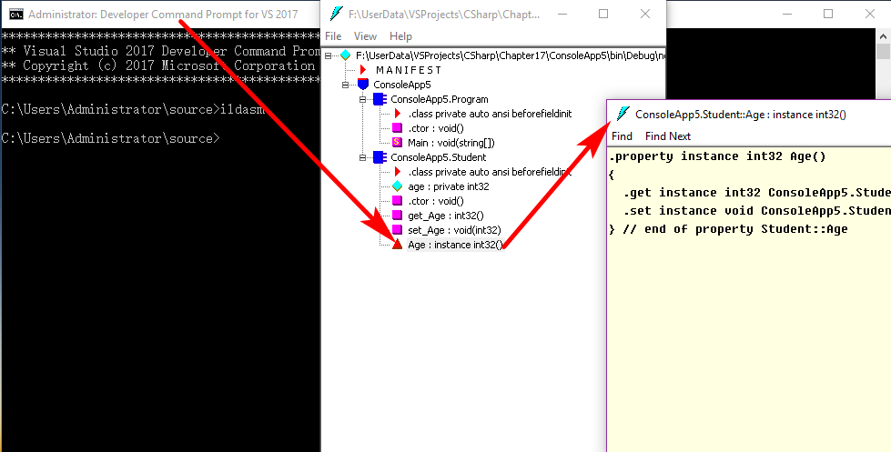
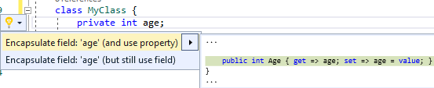

# 类型成员 field, property, indexer, constant

- [类型成员 field, property, indexer, constant](#%E7%B1%BB%E5%9E%8B%E6%88%90%E5%91%98-field-property-indexer-constant)
    - [field](#field)
    - [property](#property)
        - [property的声明](#property%E7%9A%84%E5%A3%B0%E6%98%8E)
    - [indexer](#indexer)
    - [constant成员](#constant%E6%88%90%E5%91%98)
    - [Summary](#summary)

这四种类型的成员都是用来表达数据的；其中的类型指的是`class`,`struct`

C#的`class`,`struct`具有如下成员：

- 常量：与类关联的常量值
- 字段(field)：类的变量，也就是**成员变量**
- 方法(method)：类可执行的计算和操作
- 属性(property)：与读写类的命名属性相关联的操作
- 索引器(indexer)：与以数组方式索引类的实例相关联的操作
- 事件(event)：可由类生成的通知
- 运算符(operator)：类所支持的转换和表达式运算符
- 构造函数(ctor)：初始化类的实例或类本身所需的操作
- 析构函数(destructor)：永久丢弃类的实例之前执行的操作
- 类型：类所声明的嵌套类型

## field

```csharp
class MyClass{
    //字段必须在类体里面,是property的低级形态，多个字段组合起来可以表示当前instance或者类型所处的状态

    //字段的声明不是语句，因为不在方法体中；字段命名尽量用名词或者名词短语

    //字段的默认值就是该字段数据类型的初始值(也就是内存刷0)，所以字段“永远都不会未被初始化”
    //字段声明的时候初始化和在ctor中初始化是一样的

    //实例字段初始化发生在创建instance的时候，每次创建的时候都会执行
    //静态字段初始化发生在运行环境加载(load)该类型的时候，只执行一次；这个时候静态构造器会被调用
    public int ID=0;//public实例字段
    public string Name;//public实例字段
    static public int Amount;//public静态字段
    public readonly string gender;//只读实例字段，只能在这里或者ctor中初始化

    //静态构造器
    static MyClass(){
        //数据类型被加载的时候执行，并且只是执行一次
    }
}
```

```csharp
//another example
using System;
using System.Collections.Generic;

namespace ConsoleApp1
{
    class Program
    {
        static void Main(string[] args)
        {
            List<MyClass> myList = new List<MyClass>();
            for (int i = 0; i < 10; i++) {
                MyClass temp = new MyClass();
                temp.Number = i;
                myList.Add(temp);
            }

            Console.WriteLine(MyClass.Amount);//10
        }
    }

    class MyClass {
        int id;//private实例字段
        public int Number;//public实例字段
        static public double AverageScore;//public静态字段
        static public int Amount;//public静态字段
        public MyClass() {
            MyClass.Amount++;
        }
    }
}
```

field字面意思是田地，也就是一块空间，表示了field的作用是占用内存的空间，存储数据

field: 是一种表示与**对象**或者**类型**(class or struct)关联的变量，用于存储数据。与方法体中的局部变量不同(方法体中的局部变量用于暂时存储数据)

- 字段是类型的成员，旧称“**成员变量**”
- 与instance管理的field是**实例字段**，与类型关联的field叫做**静态字段**(用static修饰)

```csharp
using System;

namespace ConsoleApp2
{
    class Program
    {
        static void Main(string[] args)
        {
            Console.WriteLine(Brush.DefaultColor.Red);//0
            Console.WriteLine(Brush.DefaultColor.Green);//0
            Console.WriteLine(Brush.DefaultColor.Blue);//0
        }
    }

    struct Color {
        public int Red;
        public int Green;
        public int Blue;
    }

    class Brush {
        //静态只读字段
        public static readonly Color DefaultColor = new Color() { Red = 0, Green = 0, Blue = 0 };
    }
}
```

```csharp
//静态字段用静态构造器初始化
//和上面的效果是一样的
class Brush {
    //静态只读字段
    public static readonly Color DefaultColor;
    static Brush() {
         DefaultColor= new Color() { Red = 0, Green = 0, Blue = 0 };
    }
}
```

```csharp
//an example
using System;
using System.Collections.Generic;

namespace ConsoleApp3
{
    class Program
    {
        static void Main(string[] args)
        {
            List<Student> myList = new List<Student>();
            for (int i = 0; i < 10; i++) {
                Student stu = new Student();
                stu.Age = 26;
                stu.Score = i;
                myList.Add(stu);
            }

            int totalAge = 0;
            double totalScore = 0;
            foreach (var item in myList) {
                totalAge += item.Age;
                totalScore += item.Score;
            }
            Student.AverageAge = totalAge / Student.Amount;
            Student.AverageScore = totalScore / Student.Amount;

            Student.ReportAmount();//10
            Student.ReportAveAge();//26
            Student.ReportAveScore();//4.5
        }
    }

    class Student {
        public int Age;
        public double Score;

        public static int Amount;
        public static int AverageAge;
        public static double AverageScore;

        public Student() {
            Student.Amount++;
        }

        public static void ReportAmount() {
            Console.WriteLine(Student.Amount);
        }

        public static void ReportAveAge() {
            Console.WriteLine(Student.AverageAge);
        }

        public static void ReportAveScore() {
            Console.WriteLine(Student.AverageScore);
        }
    }
}
```

## property

property: 是一种用于**访问对象或者类型特征**的成员，特征反映了**状态**

property是对field的一次包装：由`Get`,`Set`方法进化而来，其实是一个语法糖

- 从命名上看，field更加偏向于实例或者类型在内存中的布局；property更加偏向于反映现实世界对象的特征
- 对外： **暴露数据**，数据可以是直接存储在字段里的，也可以是动态计算出来的(下面的canwork方法就是这么样的，需要`return`)
- 对内： 保护字段不被非法值“污染”

```csharp
//使用字段和Get,Set来模仿property
//C++和Java中仍然支持这种方法，因为C++和Java没有属性的概念
using System;

namespace ConsoleApp4
{
    class Program
    {
        static void Main(string[] args)
        {
            Student stu = new Student();
            try {
                stu.SetAge(200);
            }
            catch (Exception e) {

                Console.WriteLine(e.Message);
            }//Age must be 0~120
        }
    }

    class Student {
        private int age;
        //diy Get
        public int GetAge() {
            return this.age;
        }
        //diy Set
        public void SetAge(int value) {
            if (value>=0 && value<=120) {
                this.age = value;
            }
            else {
                throw new Exception("Age must be 0~120");//msg就是引号里面的内容
            }
        }
    }
}
```

```csharp
//微软默认准备了一个叫做value的上下文关键字，代表用户传入的值
using System;

namespace ConsoleApp5
{
    class Program
    {
        static void Main(string[] args)
        {
            try {
                Student stu = new Student();
                stu.Age = 200;
            }
            catch (Exception e) {
                Console.WriteLine(e.Message);
            }
        }
    } 

    class Student {
        private int age;

        public int Age {
            get { return age; }
            set {
                if (value>=0 && value <=120) {
                    this.age = value;
                }
                else {
                    throw new Exception("Age must be 0~120");
                }
            }
        }
    }
}
```



property语法糖其实就是编译器帮助生成了相应的Get/Set方法对；

### property的声明

property的声明分为：根据get,set对的情况

- 完整声明：后台字段+访问器set/get
- 简略声明：和public字段没有功能上的差别，也会被污染；只是为了传递数据

```csharp
using System;

namespace ConsoleApp7
{
    class Program
    {
        static void Main(string[] args)
        {
            try {
                Student.Amount = -100;
                Console.WriteLine(Student.Amount);
            }
            catch (Exception e) {

                Console.WriteLine(e.Message);
            }
        }
    }

    class Student {
        //propfull, 实例属性的完整声明
        private int myVar;

        public int MyProperty {
            get { return myVar; }
            set { myVar = value; }
        }
        //prop,实例属性的简略声明
        public int MyAnotherProperty { get; set; }

        //静态属性的完整声明
        private static int amount;

        public static int Amount {
            get { return amount; }
            set {
                if (value>=0) {
                    amount = value;
                }
                else {
                    throw new Exception("Amount must >=0");
                }
            }
        }
        //静态属性的简略声明
        public static int AverageScore { get; set; }
    }
}
```

vs高级版本的功能：Edit/Refactor(代码重构)



```csharp
//vs高级版本的功能：Edit/Refactor(代码重构)
class MyClass {
    private int age;

    public int Age { get => Age1; set => Age1 = value; }//使用属性重构
    public int Age1 { get => age; set => age = value; }//使用字段重构
}
```

```csharp
//内外只读的property
class Student {
    //propfull, 实例属性的完整声明
    private int myVar;
    public int MyProperty {
        get { return myVar; }
        // set { myVar = value; }//去掉这个就是只读的了
    }
```

```csharp
//外部只读的property
class Student {
    //propfull, 实例属性的完整声明
    private int myVar;
    public int MyProperty {
        get { return myVar; }
        private set { myVar = value; }//去掉这个就是只读的了
    }
```

动态计算返回属性值：对外的接口可以不变，可以改变class内部逻辑，比如下面两个内部逻辑不同，接口相同

```csharp
//动态调用的时候计算属性值，暴露数据
using System;

namespace ConsoleApp9
{
    class Program {
        static void Main(string[] args) {
            Person p1 = new Person();
            p1.Age = 13;
            Console.WriteLine(p1.CanWork);//False
        }
    }

    class Person {
        private int age;

        public int Age {
            get { return age; }
            set {
                age = value;
            }
        }

        public bool CanWork {
            get {
                //调用的时候动态计算属性值
                if (this.age>=16) {
                    return true;
                }
                else {
                    return false;
                }
            }
        }
    }
}
```

```csharp
//动态主动计算属性值，暴露数据
using System;

namespace ConsoleApp8
{
    class Program
    {
        static void Main(string[] args)
        {
            Person p1 = new Person();
            p1.Age = 13;
            Console.WriteLine(p1.CanWork);//False，这里的CanWork是主动计算出来的
        }
    }

    class Person {
        private int age;

        public int Age {
            get { return age; }
            set {
                age = value;
                this.CalculateCanWork();//主动计算
            }
        }

        private bool canWork;

        public bool CanWork {
            get { return canWork; }
        }

        private void CalculateCanWork() {
            if (this.age>=16) {
                this.canWork = true;
            }
            else {
                this.canWork = false;
            }
        }
    }
}
```

如果频繁访问CanWork, CanWork每次访问都计算，浪费计算性能，不如设定年龄的时候主动计算出来；
如果频繁访问Age,那么主动计算浪费性能，要采用访问CanWork的时候计算；

属性vs字段：

- 建议永远使用属性而不是字段暴露数据，字段永远是`private`或者`protected`

## indexer

indexer: 它使得对象能够通过`[]`进行索引，没有静态索引器；

拥有indexer的一般是集合类型，然而有例外

```csharp
//例外情况, indexer用于非集合类型
using System;
using System.Collections.Generic;

namespace ConsoleApp10
{
    class Program
    {
        static void Main(string[] args)
        {
            ```
            Student stu = new Student();
            var mathScore = stu["Math"];//null
            Console.WriteLine(mathScore==null);//True
            //
            stu["English"] = 100;
            var englishScore = stu["English"];
            Console.WriteLine(englishScore);
        }
    }

    class Student {
        private Dictionary<string, int> scoreDict = new Dictionary<string, int>();

        public int? this[string mySubject] {
            get {
                if (this.scoreDict.ContainsKey(mySubject)) {
                    return this.scoreDict[mySubject];
                }
                else {
                    return null;
                }
            }
            set {
                if (value.HasValue==false) {
                    throw new Exception("must set not null");
                }
                if (this.scoreDict.ContainsKey(mySubject)) {
                    this.scoreDict[mySubject] = value.Value;//因为int?可空，所以value改成value.Value
                }
                else {
                    this.scoreDict.Add(mySubject, value.Value);
                }
            }
        }
    }
}
```

## constant成员

constant: 表示常量值的类成员，隶属于类型而不是实例

常量隶属于类型而不是实例，即没有“实例常量”：“实例常量”的角色由只读实例字段来担当；

注意区分成员常量(class中的const)和局部常量(方法体中的const)；

```csharp
double x=Math.PI;//程序编译的时候将Math.PI直接替换成数值，提高运行效率
//
public const double PI=3.1415926
```

```csharp
//diy const
using System;

namespace ConsoleApp11
{
    class Program
    {
        static void Main(string[] args)
        {
            Console.WriteLine(MyClass.WEB);
        }
    }

    class MyClass {
        public const string WEB = "www.baidu.com";
    }
}
```

## Summary

关于**只读**：

- 为了提高程序可读性、执行效率: 常量，只能是基本数据类型int,double,...
- 为了防止对象的值被修改：只读字段
- 向外暴露不允许修改的数据：静态、非静态只读属性；静态只读属性功能与常量有一些重叠，但是常量效率高
- 静态只读字段：如下解释

```csharp
struct Color {
    public int Red;
    public int Green;
    public int Blue;
}

class Brush {
    //不能用const修饰自定义类型，为了解决这个问题，采用静态只读字段
    //静态只读字段，常量只能基本类型，而静态只读字段可以自定义类型
    public static readonly Color DefaultColor = new Color() { Red = 0, Green = 0, Blue = 0 };
}
```