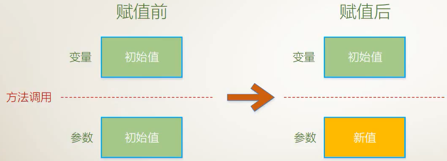
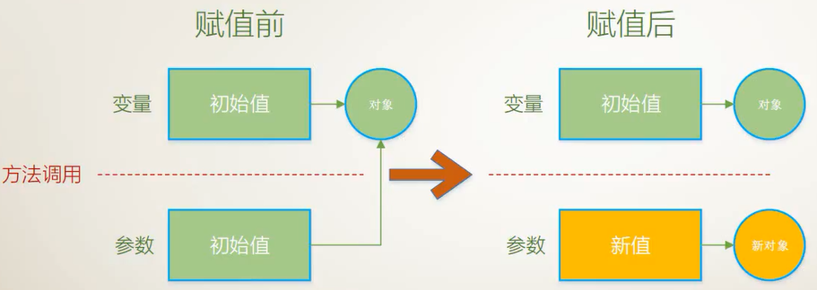
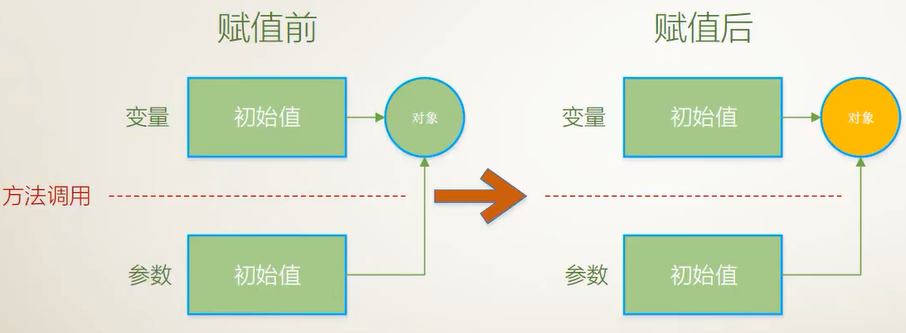
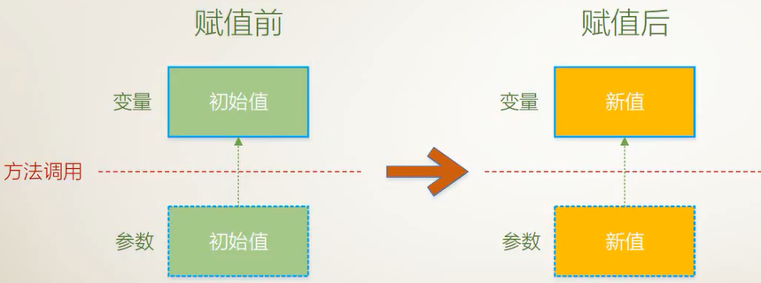
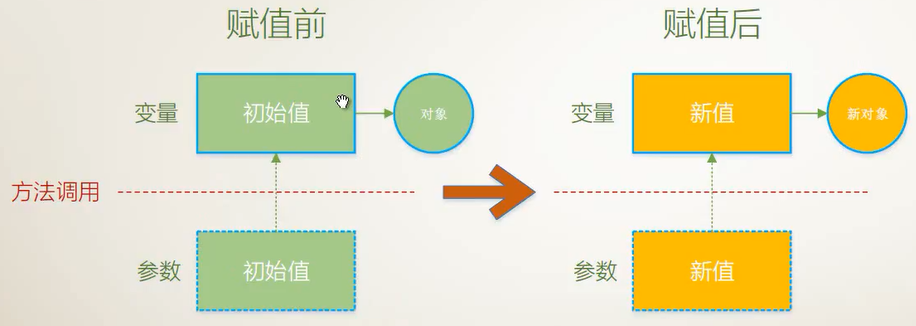
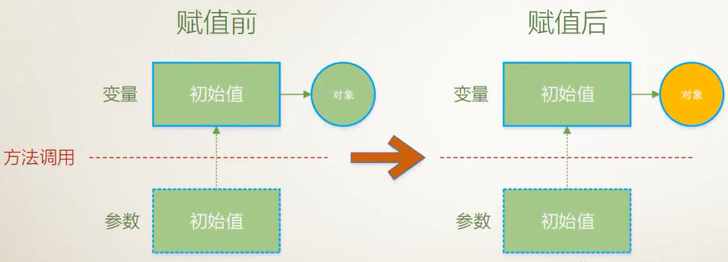
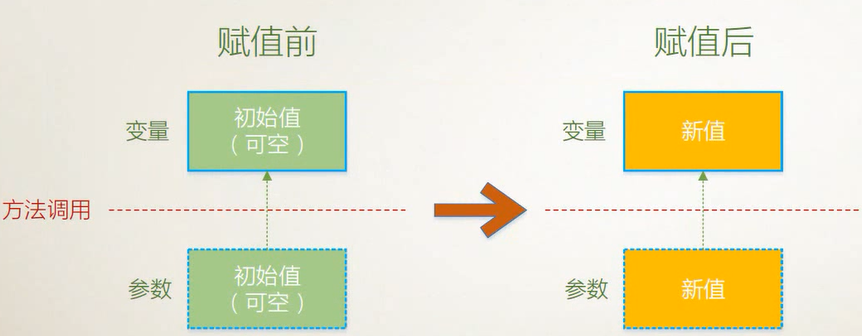
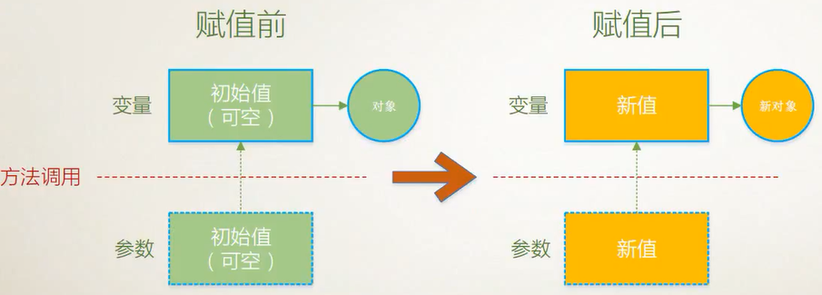

# Method Parameter

- [Method Parameter](#method-parameter)
    - [值参数： 创建副本](#%E5%80%BC%E5%8F%82%E6%95%B0%EF%BC%9A-%E5%88%9B%E5%BB%BA%E5%89%AF%E6%9C%AC)
        - [数据类型为**值类型**的值参数](#%E6%95%B0%E6%8D%AE%E7%B1%BB%E5%9E%8B%E4%B8%BA%E5%80%BC%E7%B1%BB%E5%9E%8B%E7%9A%84%E5%80%BC%E5%8F%82%E6%95%B0)
        - [数据类型为**引用类型**的值参数](#%E6%95%B0%E6%8D%AE%E7%B1%BB%E5%9E%8B%E4%B8%BA%E5%BC%95%E7%94%A8%E7%B1%BB%E5%9E%8B%E7%9A%84%E5%80%BC%E5%8F%82%E6%95%B0)
    - [`ref`参数: 不创建副本，原地修改](#ref%E5%8F%82%E6%95%B0-%E4%B8%8D%E5%88%9B%E5%BB%BA%E5%89%AF%E6%9C%AC%EF%BC%8C%E5%8E%9F%E5%9C%B0%E4%BF%AE%E6%94%B9)
        - [数据类型为**值类型**的`ref`参数](#%E6%95%B0%E6%8D%AE%E7%B1%BB%E5%9E%8B%E4%B8%BA%E5%80%BC%E7%B1%BB%E5%9E%8B%E7%9A%84ref%E5%8F%82%E6%95%B0)
        - [数据类型为**引用类型**的`ref`参数](#%E6%95%B0%E6%8D%AE%E7%B1%BB%E5%9E%8B%E4%B8%BA%E5%BC%95%E7%94%A8%E7%B1%BB%E5%9E%8B%E7%9A%84ref%E5%8F%82%E6%95%B0)
    - [`out`参数：不创建副本，原地修改](#out%E5%8F%82%E6%95%B0%EF%BC%9A%E4%B8%8D%E5%88%9B%E5%BB%BA%E5%89%AF%E6%9C%AC%EF%BC%8C%E5%8E%9F%E5%9C%B0%E4%BF%AE%E6%94%B9)
        - [数据类型为**值类型**的out参数](#%E6%95%B0%E6%8D%AE%E7%B1%BB%E5%9E%8B%E4%B8%BA%E5%80%BC%E7%B1%BB%E5%9E%8B%E7%9A%84out%E5%8F%82%E6%95%B0)
        - [数据类型为**引用类型**的out参数](#%E6%95%B0%E6%8D%AE%E7%B1%BB%E5%9E%8B%E4%B8%BA%E5%BC%95%E7%94%A8%E7%B1%BB%E5%9E%8B%E7%9A%84out%E5%8F%82%E6%95%B0)
    - [数组参数(`params`)](#%E6%95%B0%E7%BB%84%E5%8F%82%E6%95%B0params)
    - [具名参数(Named parameters)](#%E5%85%B7%E5%90%8D%E5%8F%82%E6%95%B0named-parameters)
    - [可选参数(具有默认值的参数)(Optional parameters)](#%E5%8F%AF%E9%80%89%E5%8F%82%E6%95%B0%E5%85%B7%E6%9C%89%E9%BB%98%E8%AE%A4%E5%80%BC%E7%9A%84%E5%8F%82%E6%95%B0optional-parameters)
    - [Extension Methods(扩展方法)(`this`参数)](#extension-methods%E6%89%A9%E5%B1%95%E6%96%B9%E6%B3%95this%E5%8F%82%E6%95%B0)

参数(parameter):

- 传值参数：参数的默认传递方式(99%的场景)
- 输出参数：用于除返回值外还需要输出的场景
- 引用参数：用于需要修i该实际参数的场景
- 数组参数：用于简化方法的调用
- 具名参数：提高可读性
- 可选参数：参数拥有默认值
- 扩展方法(this参数)：为目标数据类型“追加”方法

## 值参数： 创建副本

值参数不带修饰符，对应于一个局部变量，初始值来自方法调用提供的相应实参

### 数据类型为**值类型**的值参数



- 值参数创建变量的副本；
- 对值参数的操作不会影响变量的值

```csharp
using System;

namespace ConsoleApp1
{
    class Program
    {
        static void Main(string[] args)
        {
            int y = 100;
            MyClass my1 = new MyClass();
            my1.Report(y);//101
            Console.WriteLine(y);//100
        }
    }

    class MyClass {
        public void Report(int x) {//int 是数据类型，并不是修饰符;并且int是值类型
            Console.WriteLine($"{x+1}");
        }
    }
}
```

### 数据类型为**引用类型**的值参数

值参数创建instance:(用得少)



值参数不创建instance:(用得少，尽量避免；作为方法而言，主要输出还是靠返回值)

**隐式**指出：此方法的副作用是改变实参的值



用HashCode区分变量，`GetHashCode()`是`object`的方法，任何对象都有这个方法；得到的HashCode代表对象的唯一值；

```csharp
//引用参数创建instance
using System;

namespace ConsoleApp2
{
    class Program
    {
        static void Main(string[] args)
        {
            Student stu = new Student() { Name = "James" };
            Report(stu);//43495525,Chris
            Console.WriteLine($"{stu.GetHashCode()},{stu.Name}");//55915408,James
        }

        static void Report(Student student) {
            student = new Student() { Name = "Chris" };//如果又创建了实例，那么就不会影响变量的值
            Console.WriteLine($"{student.GetHashCode()},{student.Name}");
        }
    }

    class Student {
        public string Name { get; set; }
    }
}
```

```csharp
//引用参数不创建instance
using System;

namespace ConsoleApp2
{
    class Program
    {
        static void Main(string[] args)
        {
            Student stu = new Student() { Name = "James" };
            Report(stu);//43495525,Chris
            Console.WriteLine($"{stu.GetHashCode()},{stu.Name}");//43495525,Chris
        }

        static void Report(Student student) {
            student.Name = "Chris";//没有创建实例，就会影响变量的值；通过传入的参数修改引用的对象的值，叫做方法的side-effect
            Console.WriteLine($"{student.GetHashCode()},{student.Name}");
        }
    }

    class Student {
        public string Name { get; set; }
    }
}
```

Tip: 修改方法体中的一个变量名之后，智能提示，修改所有的变量名；

## `ref`参数: 不创建副本，原地修改

被使用的实参要提前赋值；

使用`ref`修饰符**显式**指出：此方法的副作用是改变实参的值

### 数据类型为**值类型**的`ref`参数



```csharp
using System;

namespace ConsoleApp3
{
    class Program
    {
        static void Main(string[] args)
        {
            int y = 100;
            AddOne(ref y);
            Console.WriteLine($"{y.GetHashCode()},{y}");//101,101
        }

        static void AddOne(ref int x) {
            x += 1;
            Console.WriteLine($"{x.GetHashCode()},{x}");//101,101
        }
    }
}
```

### 数据类型为**引用类型**的`ref`参数

`ref`参数创建instance(用的多)：



`ref`参数不创建instance(用的少)：因为此时与传值参数效果一样，机理不同；面试恶心你



```csharp
//ref参数创建instance
using System;

namespace ConsoleApp4
{
    class Program
    {
        static void Main(string[] args)
        {
            Student stu = new Student() { Name = "James" };
            Console.WriteLine($"{stu.GetHashCode()},{stu.Name}");//43495525,James
            MySideEffect(ref stu);
            Console.WriteLine($"{stu.GetHashCode()},{stu.Name}");//55915408,Chris
        }

        static void MySideEffect(ref Student student) {//student是引用类型的引用参数
            student = new Student() { Name = "Chris" };//创建instance
            Console.WriteLine($"{student.GetHashCode()},{student.Name}");//55915408,Chris
        }
    }

    class Student {
        public string Name { get; set; }
    }
}
```

```csharp
//ref参数不创建instance
using System;

namespace ConsoleApp5
{
    class Program
    {
        static void Main(string[] args)
        {
            Student stu = new Student() { Name="James" };
            Console.WriteLine($"{stu.GetHashCode()},{stu.Name}");//43495525,James
            MySideEffect(ref stu);
            Console.WriteLine($"{stu.GetHashCode()},{stu.Name}");//43495525,Chris
        }

        static void MySideEffect(ref Student student) {//不创建instance
            //与引用类型的传值不同的是
            //引用类型的值参数的地址与实参的地址不同(因为副本机制)
            //引用类型的ref参数的地址与实参的地址相同(因为ref)
            student.Name = "Chris";
            Console.WriteLine($"{student.GetHashCode()},{student.Name}");//43495525,Chris
        }
    }

    class Student {
        public string Name { get; set; }
    }
}
```

## `out`参数：不创建副本，原地修改

一个方法产生多个返回值，有意利用side-effect

out参数的实参，不要求提前赋值；方法体中的out参数要明确赋值

### 数据类型为**值类型**的out参数



```csharp
static void Main(string[] args)
{
    string str = "123.4";
    double x = 0;
    bool isOK=double.TryParse(str, out x);
    if (!isOK) {
        Console.WriteLine("Input error");
        return;
    }
    else {
        Console.WriteLine(x);//123.4
    }
}
```

```csharp
//my out example
using System;

namespace ConsoleApp6
{
    class Program
    {
        static void Main(string[] args)
        {
            string str = "a";
            double x;
            bool isOK=MyParse.TryParse(str, out x);
            if (!isOK) {
                Console.WriteLine("Input error");
                return;
            }
            else {
                Console.WriteLine(x);//123.4
            }
        }
    }

    class MyParse {
        public static bool TryParse(string s,out double res) {
            try {
                res = double.Parse(s);
                return true;
            }
            catch (Exception) {
                res = 0;
                return false;
            }
        }
    }
}
```

### 数据类型为**引用类型**的out参数



```csharp
using System;
using System.Collections.Generic;

namespace ConsoleApp7
{
    class Program
    {
        static void Main(string[] args)
        {
            Random r = new Random();
            List<Student> myList = new List<Student>();
            for (int i = 0; i < 10; i++) {
                Student stu = null;
                bool isOK = StudentFactory.Create("Number " + i.ToString(),r.Next(10,100), out stu);
                if (isOK) {
                    Console.WriteLine($"{stu.Name},{stu.Age}");
                    myList.Add(stu);
                }
            }
            //
            Console.WriteLine();
            foreach (var item in myList) {
                Console.WriteLine($"{item.Name},{item.Age}");
            }
        }
    }

    class Student {
        public string Name { get; set; }
        public int Age { get; set; }
    }

    class StudentFactory {
        public static bool Create(string stuName,int stuAge,out Student res) {
            res = null;
            if (string.IsNullOrEmpty(stuName)||stuAge<20||stuAge>80) {
                return false;
            }
            //
            res = new Student() { Name = stuName, Age = stuAge };
            return true;
        }
    }
}
```

```bash
#output
Number 0,57
Number 3,66
Number 5,52
Number 8,61
Number 9,43

Number 0,57
Number 3,66
Number 5,52
Number 8,61
Number 9,43
```

## 数组参数(`params`)

必须是形参列表的最后一个，由`params`修饰；并且形参列表中只能有一个`params`

比如`string.Format`和`string.Split`方法,`Console.Wriline`可以接收任意个参数

```csharp
//without params
using System;

namespace ConsoleApp8
{
    class Program
    {
        static void Main(string[] args)
        {
            //without params，需要提前准备一个数组
            int[] myArray = { 1, 2, 3, 4, 5 };
            int res = CalculateSum(myArray);
            Console.WriteLine(res);//15
        }

        static int CalculateSum(int[] array) {
            int sum = 0;
            foreach (var item in array) {
                sum += item;
            }
            return sum;
        }
    }
}
```

```csharp
//with params
using System;

namespace ConsoleApp8
{
    class Program
    {
        static void Main(string[] args)
        {
            int res = CalculateSum(1,2,3,4,5);
            Console.WriteLine(res);//15
        }

        static int CalculateSum(params int[] array) {
            int sum = 0;
            foreach (var item in array) {
                sum += item;
            }
            return sum;
        }
    }
}
```

```csharp
int x = 10;
double y = 10.3;
string str = "grey";
Console.WriteLine("{0},{1},{2}",x,y,str);//先把后面的x,y,str生成object[]的数组
```

```csharp
static void Main(string[] args)
{
    string str = "Tim;James,Grey.Moris>Tom";
    string[] res=str.Split(';', ',', '.', '.', '>');
    foreach (var item in res) {
        Console.WriteLine(item);
    }
}
```

```bash
#output
Tim
James
Grey
Moris
Tom
```

## 具名参数(Named parameters)

严格来讲，只是一种参数的使用方法；

- 提高可读性
- 不受参数顺序的限制

```csharp
using System;

namespace ConsoleApp10
{
    class Program
    {
        static void Main(string[] args)
        {
            PrintInfo("Grey", 26);//Grey,26
            PrintInfo(name: "James", age: 23);//James,23
            PrintInfo(age: 28, name: "Chris");//Chris,28
        }

        static void PrintInfo(string name, int age) {
            Console.WriteLine($"{name},{age}");
        }
    }
}
```

## 可选参数(具有默认值的参数)(Optional parameters)

```csharp
using System;

namespace ConsoleApp10
{
    class Program
    {
        static void Main(string[] args)
        {
            PrintInfo("Grey", 26);//Grey,26
            PrintInfo(name: "James", age: 23);//James,23
            PrintInfo(age: 28, name: "Chris");//Chris,28
            PrintInfo();//Grey,20
        }

        static void PrintInfo(string name="Grey", int age=20) {
            Console.WriteLine($"{name},{age}");
        }
    }
}
```

## Extension Methods(扩展方法)(`this`参数)

给使用的类型追加其他类型的方法；

- 所在的方法必须是`public static`
- `this`参数必须是参数列表第一个
- 必须由一个`static class SometypeExtension`来统一收纳对`Sometype`类型的方法

static class中的东西都是必须是static修饰，而且static不能创建对象；

```csharp
using System;

namespace ConsoleApp11
{
    class Program
    {
        static void Main(string[] args)
        {
            double x = 3.1415926;
            double y = Math.Round(x, 4);
            Console.WriteLine(y);//3.1416
            //上面的double没有Round方法，为了使它获得round方法
            //method1: 修改double类型的源码然后编译；然而编译之后无法放入C#的官方class library中去
            //method2: this参数,为目标数据类型(比如这里的double)追加方法
            double z = x.Round(5);
            Console.WriteLine(z);//3.14159
        }
    }

    // Extension 后缀为添加扩展方法时所在类的类名的约定
    // DoubleExtension 为 double 类 的扩展
    static class DoubleExtension {
        public static double Round(this double input,int digits) {
            double res = Math.Round(input, digits);
            return res;
        }
    }
}
```

```csharp
//LINQ方法
using System;
using System.Collections.Generic;
using System.Linq;

namespace ConsoleApp12
{
    class Program
    {
        static void Main(string[] args)
        {
            List<int> myList = new List<int>() { 11, 12, 23, 12 };
            Console.WriteLine(AllGreaterThanTen(myList));//True,without LINQ
            Console.WriteLine(myList.All(i=>i>10));//这个All就是扩展方法,来自List，List继承于static class Enumerable中，但是没有按照SometypeExtension命名而已
            //LINQ配合lamda表达式，可以缩短代码长度
        }

        static bool AllGreaterThanTen(List<int> list) {
            foreach (var item in list) {
                if (item<=10) {
                    return false;
                }
            }
            return true;
        }
    }
}
```