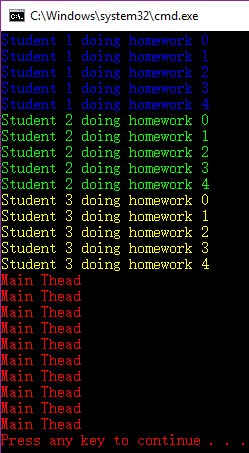
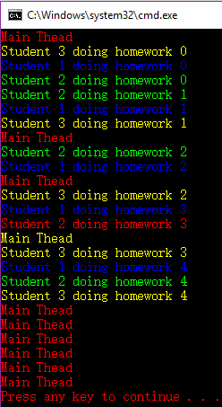

# delegate

- [delegate](#delegate)
    - [what is delegate](#what-is-delegate)
    - [delegate's declaration(自定义委托)](#delegates-declaration%E8%87%AA%E5%AE%9A%E4%B9%89%E5%A7%94%E6%89%98)
    - [delegate's usage](#delegates-usage)
    - [delegate 高级使用](#delegate-%E9%AB%98%E7%BA%A7%E4%BD%BF%E7%94%A8)
        - [multicast(多播委托)](#multicast%E5%A4%9A%E6%92%AD%E5%A7%94%E6%89%98)
        - [隐式异步调用](#%E9%9A%90%E5%BC%8F%E5%BC%82%E6%AD%A5%E8%B0%83%E7%94%A8)

## what is delegate

delegate是函数指针的升级版；Java中没有与delegate相对应的功能实体

一切皆地址：

- 变量(数据)是以某个地址为起点的一段内存中所存储的值；变量，是用来寻找数据的地址
- 函数(算法)是以某个地址为起点的一段内存中所存储的一组机器语言指令；函数，是用来寻找算法的地址

直接调用vs间接调用：

- 直接调用：通过函数名来调用函数，CPU通过函数名直接获得函数所在地址并开始执行→返回
- 间接调用：通过函数指针来调用函数，CPU通过读取函数指针存储的值获得函数所在地址并开始执行→返回

```csharp
//C#已经准备好的委托Action,Func<>
using System;

namespace ConsoleApp1
{
    class Program
    {
        static void Main(string[] args)
        {
            Calculator calc = new Calculator();
            Action action = new Action(calc.Report);//Action只接受void返回值的函数
            calc.Report();//I have 3 methods
            action.Invoke();//I have 3 methods
            action();//I have 3 methods,简略写法
            //非void的委托
            Func<int, int, int> func1 = new Func<int, int, int>(calc.MyAdd);
            Func<int, int, int> func2 = new Func<int, int, int>(calc.MyMul);
            Console.WriteLine(func1(10,20));//30
            Console.WriteLine(func1.Invoke(10,20));//30
            Console.WriteLine(func2(10,20));//200
            Console.WriteLine(func2.Invoke(10,20));//200
        }
    }

    class Calculator {
        public void Report() {
            Console.WriteLine("I have 3 methods");
        }
        public int MyAdd(int a,int b) {
            return a + b;
        }

        public int MyMul(int a,int b) {
            return a * b;
        }
    }
}
```

## delegate's declaration(自定义委托)

delegate是一种class，也就是一种数据类型；

```csharp
Type t1 = typeof(Action);
Type t2 = typeof(Func<int, int, int>);
Console.WriteLine(t1.IsClass);//True
Console.WriteLine(t2.IsClass);//True
```

`delegate`的声明方式与一般class不同，主要是为了照顾可读性和C/C++传统；

```c
//C语言中的指针
#include <stdio.h>
#include <stdlib.h>

typedef double(*Calc)(double, double);

double MyAdd(double x, double y) {
	return x + y;
}

double MySub(double x, double y) {
	return x - y;
}

double MyMul(double x, double y) {
	return x * y;
}

int main() {
	Calc p1 = MyAdd;
	Calc p2 = MySub;
	Calc p3 = MyMul;
	printf("%f\n", MyAdd(10.2, 10.3));

	system("pause");
	return 0;
}
```

```csharp
//c#中的委托
using System;

namespace ConsoleApp2
{
    class Program
    {
        static void Main(string[] args)
        {
            Calculator myCalc = new Calculator();
            Calc calc1 = new Calc(myCalc.MyAdd);
            Calc calc2 = new Calc(myCalc.MySub);
            Calc calc3 = new Calc(myCalc.MyMul);
            Calc calc4 = new Calc(myCalc.MyDiv);
            //还是自带的Func好用
            Console.WriteLine(calc1(10.2,10.5));
            Console.WriteLine(calc1.Invoke(10.2,10.5));
            Console.WriteLine(calc2(10.2,10.5));
            Console.WriteLine(calc3(10.2,10.5));
            Console.WriteLine(calc4(10.2,10.5));
        }
    }

    class Calculator {
        public double MyAdd(double x,double y) {
            return x + y;
        }

        public double MySub(double x, double y) {
            return x - y;
        }

        public double MyMul(double x, double y) {
            return x * y;
        }

        public double MyDiv(double x, double y) {
            return x / y;
        }
    }

    //delegate是一种class，所以放在namespace中
    //虽然可以嵌套class，所以也是可以嵌套delegate的；但是这样做，不好
    delegate double Calc(double a,double b);//委托要与容纳的函数“类型兼容”(参数类型和返回值类型对应)
}
```

## delegate's usage

一般使用：把方法当作参数，传递到另一个方法中去,形成动态调用的结构；

- 正确使用：**模板方法**，借用指定的外部方法产生结果；相当于填空题、位于代码中部、委托有返回值
- 正确使用：**回掉方法**，调用指定的外部方法；相当于“流水线”、位于代码尾部、委托无返回值

模板方法：有一处是不确定的(因为调用的外部方法不确定)

回掉方法：外部方法可以调用它，可以不调用它；用得着的时候调用它，用不着的时候不调用它；动态给机会选择调用的方法(可以从一堆方法中选择一个来调用)；用于执行一些后续工作，构造流水线结构

```csharp
//模板方法例子
using System;

namespace ConsoleApp3
{
    class Program
    {
        static void Main(string[] args)
        {
            ProductFactory myFactory = new ProductFactory();
            WrapFactory myWrap = new WrapFactory();
            //
            Func<Product> func1 = new Func<Product>(myFactory.MakePizza);
            Func<Product> func2 = new Func<Product>(myFactory.MakeToy);
            //
            Box box1= myWrap.WrapProduct(func1);
            Box box2= myWrap.WrapProduct(func2);
            Console.WriteLine(box1.MyProduct.Name);//Pizza
            Console.WriteLine(box2.MyProduct.Name);//Toy
        }
    }

    class Product {
        public string Name { get; set; }
    }

    class Box {
        public Product MyProduct { get; set; }
    }

    class WrapFactory {
        //模板方法
        public Box WrapProduct(Func<Product> getProduct) {
            Box box = new Box();
            Product product = getProduct();
            box.MyProduct = product;
            return box;
        }
    }

    class ProductFactory {
        public Product MakePizza() {
            Product product = new Product();
            product.Name = "Pizza";
            return product;
        }

        public Product MakeToy() {
            Product product = new Product();
            product.Name = "Toy";
            return product;
        }
    }
}
```

```csharp
//回掉方法例子
using System;

namespace ConsoleApp3
{
    class Program
    {
        static void Main(string[] args)
        {
            ProductFactory myFactory = new ProductFactory();
            WrapFactory myWrap = new WrapFactory();
            Logger logger = new Logger();
            //
            Func<Product> func1 = new Func<Product>(myFactory.MakePizza);
            Func<Product> func2 = new Func<Product>(myFactory.MakeToy);
            Action<Product> logAction = new Action<Product>(logger.Log);
            //
            Box box1= myWrap.WrapProduct(func1,logAction);
            Box box2= myWrap.WrapProduct(func2,logAction);
            Console.WriteLine(box1.MyProduct.Name);//Pizza
            Console.WriteLine(box2.MyProduct.Name);//Toy
        }
    }

    class Product {
        public string Name { get; set; }
        public double Price { get; set; }
    }

    class Box {
        public Product MyProduct { get; set; }
    }

    class WrapFactory {
        //模板方法+回掉方法
        public Box WrapProduct(Func<Product> getProduct,Action<Product> logCallback) {
            Box box = new Box();
            Product product = getProduct();
            if (product.Price>50) {
                logCallback(product);
            }
            box.MyProduct = product;
            return box;
        }
    }

    class ProductFactory {
        public Product MakePizza() {
            Product product = new Product();
            product.Name = "Pizza";
            product.Price = 49;
            return product;
        }

        public Product MakeToy() {
            Product product = new Product();
            product.Name = "Toy";
            product.Price = 99;
            return product;
        }
    }

    class Logger {
        //记录程序运行的状态
        public void Log(Product product) {
            Console.WriteLine($"{product.Name} is created at {DateTime.UtcNow}.Price is {product.Price}");
        }
    }
}
```

delegate: 难精通、易使用、功能强大

- 缺点1，这是一种方法级别的紧耦合
- 缺点2，可读性下降、debug难度增大
- 缺点3，把委托回掉、异步调用、多线程纠缠在一起，会使得代码难以阅读和维护
- 缺点4，delegate使用不当有可能造成内存泄漏和程序性能下降

如果用委托，那么这个委托所包含的方法来自一个instance，这个instance必须存在于内存中,没有其他变量引用这个instance，这个instance也不能被释放,可能造成内存泄漏；

```csharp
//滥用委托的反例
using System;

namespace ConsoleApp4
{
    class Program
    {
        static void Main(string[] args)
        {
            Operation opt1 = new Operation();
            Operation opt2 = new Operation();
            Operation opt3 = new Operation();
            opt3.InnerOperation = opt2;
            opt2.InnerOperation = opt1;
            //
            opt3.Operate(new object(), null, null);
            //问题1：如果传入的两个参数为null,失败和成功的效果是什么？答：内层的操作会调用外层的回掉！
            //问题2：如果传入的两个参数不为null,会出现什么情况？答：三层中每一层都是调用传入的回掉，传入的回掉把所有的回掉都穿透性屏蔽掉了
        }
    }

    class Operation {
        public Action DefaultSuccessCallback { get; set; }
        public Action DefaultFailureCallback { get; set; }
        public Operation InnerOperation { get; set; }

        public object Operate(object input,Action successCallback,Action failureCallback) {
            if (successCallback==null) {
                successCallback = this.DefaultSuccessCallback;
            }
            if (failureCallback==null) {
                failureCallback = this.DefaultSuccessCallback;
            }
            //
            object result = null;
            try {
                result = this.InnerOperation.Operate(input, successCallback, failureCallback);
                //Do something;
            }
            catch (Exception) {
                failureCallback.Invoke();
            }
            successCallback.Invoke();
            return result;
        }
    }
}
```

## delegate 高级使用

### multicast(多播委托)

multicast:一个委托里面封装了不止一个方法；

```csharp
//单播委托
using System;
using System.Collections.Generic;
using System.Threading;

namespace ConsoleApp5
{
    class Program
    {
        static void Main(string[] args)
        {
            List<Student> myList = new List<Student>();
            myList.Add(new Student() { ID = 1, PenColor = ConsoleColor.Blue });
            myList.Add(new Student() { ID = 2, PenColor = ConsoleColor.Green });
            myList.Add(new Student() { ID = 3, PenColor = ConsoleColor.Yellow });
            List<Action> myActions = new List<Action>();
            for (int i = 0; i < 3; i++) {
                myActions.Add(new Action(myList[i].DoHomework));//一个委托封装一个方法，单播委托
            }
            for (int i = 0; i < 3; i++) {
                //调用委托
                myActions[i].Invoke();
            }
        }
    }

    class Student {
        public int ID { get; set; }
        public ConsoleColor PenColor { get; set; }
        //
        public void DoHomework() {
            for (int i = 0; i < 5; i++) {
                Console.ForegroundColor = this.PenColor;
                Console.WriteLine($"Student {this.ID} doing homework {i}");
                Thread.Sleep(1000);
            }
        }
    }
}
```

```csharp
//多播委托
using System;
using System.Collections.Generic;
using System.Threading;

namespace ConsoleApp5
{
    class Program
    {
        static void Main(string[] args)
        {
            List<Student> myList = new List<Student>();
            myList.Add(new Student() { ID = 1, PenColor = ConsoleColor.Blue });
            myList.Add(new Student() { ID = 2, PenColor = ConsoleColor.Green });
            myList.Add(new Student() { ID = 3, PenColor = ConsoleColor.Yellow });
            List<Action> myActions = new List<Action>();
            for (int i = 0; i < 3; i++) {
                myActions.Add(new Action(myList[i].DoHomework));//一个委托封装一个方法，单播委托
            }
            //将后两个action合并到第一个action
            myActions[0] += myActions[1];
            myActions[0] += myActions[2];
            myActions[0].Invoke();//multicast,执行的顺序是合并的顺序，也就是Yellow,Green,Red
        }
    }

    class Student {
        public int ID { get; set; }
        public ConsoleColor PenColor { get; set; }
        //
        public void DoHomework() {
            for (int i = 0; i < 5; i++) {
                Console.ForegroundColor = this.PenColor;
                Console.WriteLine($"Student {this.ID} doing homework {i}");
                Thread.Sleep(1000);
            }
        }
    }
}
```

### 隐式异步调用

同步vs异步:

- 同步：A做完了，B在A的基础上接着做
- 异步: A在做，B也在做；各自做各自的，不相干

同步调用vs异步调用:

- 每一个运行的程序是一个进程(process);

- 每一个进程(process)包含一个或者多个线程(thread)；其中第一个运行起来的thread就是**主线程**，主线程之外的线程叫做**分支线程**

- 同步调用是在同一个thread内部；
- 异步调用的底层机理是多线程(threads)

- 串行==同步==单线程；并行==异步==多线程；

同步调用:

- 直接同步调用
- 单播委托同步调用
- 多播委托同步调用


```csharp
//直接同步调用
List<Student> myList = new List<Student>();
myList.Add(new Student() { ID = 1, PenColor = ConsoleColor.Blue });
myList.Add(new Student() { ID = 2, PenColor = ConsoleColor.Green });
myList.Add(new Student() { ID = 3, PenColor = ConsoleColor.Yellow });
//主线程内同步调用三个方法
myList[0].DoHomework();
myList[1].DoHomework();
myList[2].DoHomework();
```

```csharp
//单播委托的间接同步调用
List<Student> myList = new List<Student>();
myList.Add(new Student() { ID = 1, PenColor = ConsoleColor.Blue });
myList.Add(new Student() { ID = 2, PenColor = ConsoleColor.Green });
myList.Add(new Student() { ID = 3, PenColor = ConsoleColor.Yellow });
List<Action> myActions = new List<Action>();
for (int i = 0; i < 3; i++) {
    myActions.Add(new Action(myList[i].DoHomework));
}
for (int i = 0; i < 3; i++) {
    myActions[i].Invoke();//间接同步调用
}
```

```csharp
//multicast委托的同步调用，如上面的例子所示
```



异步调用: 逻辑上的不相干(一个线程的开始和结束并不会影响到另一个线程的开始和结束)，而现实工作中经常会遇到多个线程共享(即同时访问)同一个资源(比如某个变量)的情况，这时候如果处理不当就会产生线程间争夺资源的冲突；

- 使用delegate的隐式异步调用
- 自己显式声明多线程Thread
- 自己显式声明多线程Task


```csharp
//使用委托进行隐式异步调用
using System;
using System.Collections.Generic;
using System.Threading;

namespace ConsoleApp6 {
    class Program {
        static void Main(string[] args) {
            List<Student> myList = new List<Student>();
            myList.Add(new Student() { ID = 1, PenColor = ConsoleColor.Blue });
            myList.Add(new Student() { ID = 2, PenColor = ConsoleColor.Green });
            myList.Add(new Student() { ID = 3, PenColor = ConsoleColor.Yellow });
            List<Action> myActions = new List<Action>();
            for (int i = 0; i < 3; i++) {
                myActions.Add(new Action(myList[i].DoHomework));
            }

            myActions[0].BeginInvoke(null, null);
            myActions[1].BeginInvoke(null, null);
            myActions[2].BeginInvoke(null, null);
            //Invoke是在主线程内同步调用，BeginInvoke()会自动生成一个分支线程，第一个参数异步调用的回掉(分支线程执行完毕之后再干什么),第二个参数查MSDN

            for (int i = 0; i < 10; i++) {
                Console.ForegroundColor = ConsoleColor.Red;
                Console.WriteLine("Main Thead");
                Thread.Sleep(1000);//主线程显示一下
            }
        }
    }

    class Student {
        public int ID { get; set; }
        public ConsoleColor PenColor { get; set; }
        //
        public void DoHomework() {
            for (int i = 0; i < 5; i++) {
                Console.ForegroundColor = this.PenColor;
                Console.WriteLine($"Student {this.ID} doing homework {i}");
                Thread.Sleep(1000);
            }
        }
    }
}
```

下面这个图也可以看出，多个线程发生了争抢`PenColor`这个变量；更细致的需要线程加锁



```csharp
//自动动手显式声明多线程
//method1:古老的办法Thread
List<Thread> myThreads = new List<Thread>();
for (int i = 0; i < 3; i++) {
    myThreads.Add(new Thread(new ThreadStart(myList[i].DoHomework)));
}
for (int i = 0; i < 3; i++) {
    myThreads[i].Start();
}
```

```csharp
//自动动手显式声明多线程
//method2:C#准备了更高级的方式Task
List<Task> myTasks = new List<Task>();
for (int i = 0; i < 3; i++) {
    myTasks.Add(new Task(new Action(myList[i].DoHomework)));
}
for (int i = 0; i < 3; i++) {
    myTasks[i].Start();
}
```

Tips: 适时地使用`interface`取代一些对`delegate`的使用，Java完全的使用interface取代了delegate的功能，即Java没有与C#中委托相对应的功能实体

```csharp
//工厂生产的例子，interface可以完全取代委托
using System;

namespace ConsoleApp7
{
    class Program
    {
        static void Main(string[] args)
        {
            IProductFactory pizzaFactory = new PizzaFactory();
            IProductFactory toyFactory = new ToyFactory();
            WrapFactory wrapFactory = new WrapFactory();
            //
            Box box1 = wrapFactory.WrapProduct(pizzaFactory);
            Box box2 = wrapFactory.WrapProduct(toyFactory);
            //
            Console.WriteLine(box1.MyProduct.Name);//Pizza
            Console.WriteLine(box2.MyProduct.Name);//Toy
        }
    }

    class Product {
        public string Name { get; set; }
        public double Price { get; set; }
    }

    class Box {
        public Product MyProduct { get; set; }
    }

    class WrapFactory {
        public Box WrapProduct(IProductFactory productFactory) {
            Box box = new Box();
            Product product = productFactory.Make();
            box.MyProduct = product;
            return box;
        }
    }

    interface IProductFactory {
        Product Make();
    }

    class PizzaFactory : IProductFactory {
        public Product Make() {
            Product product = new Product();
            product.Name = "Pizza";
            product.Price = 49;
            return product;
        }
    }

    class ToyFactory : IProductFactory {
        public Product Make() {
            Product product = new Product();
            product.Name = "Toy";
            product.Price = 99;
            return product;
        }
    }
}
```


