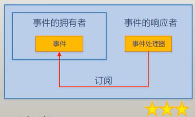
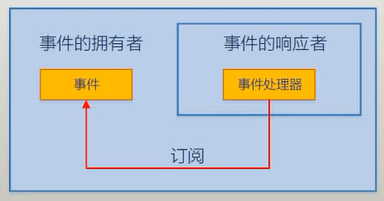

# C# Event

- [C# Event](#c-event)
    - [what is Event](#what-is-event)
        - [事件模型(Event Model,也叫做**发生→响应**模型)](#%E4%BA%8B%E4%BB%B6%E6%A8%A1%E5%9E%8Bevent-model%E4%B9%9F%E5%8F%AB%E5%81%9A%E5%8F%91%E7%94%9F%E2%86%92%E5%93%8D%E5%BA%94%E6%A8%A1%E5%9E%8B)
        - [Event Model in detail](#event-model-in-detail)
    - [Event application](#event-application)
    - [Event Declaration(自定义事件)](#event-declaration%E8%87%AA%E5%AE%9A%E4%B9%89%E4%BA%8B%E4%BB%B6)
        - [使用.net的`EventHandler`,`EventArgs`](#%E4%BD%BF%E7%94%A8net%E7%9A%84eventhandlereventargs)
        - [自定义事件标准做法](#%E8%87%AA%E5%AE%9A%E4%B9%89%E4%BA%8B%E4%BB%B6%E6%A0%87%E5%87%86%E5%81%9A%E6%B3%95)

## what is Event

事件:a thing that **happens**; 能够**发生**的什么事情(比如，苹果落地**发生**了，那么**苹果落地**就是事件)

C#事件:使对象、类具备**通知能力**的成员(an event is a member that enables an object or class to provide notifications)(比如手机有响铃事件；**响铃**这个事件让手机具备了通知关注者的能力)；**用于对象或者类间的动作协调与消息推送(信息传递)**

C#事件参数`EventArgs`:经由事件发送出来的，与事件本身相关的数据(也就是消息)

从手机角度来看，它是在通知关注者采取行动；从人的角度来看，得到了通知，可以采取行动了；

伴随着事件的发生，会产生与事件相关的数据(事件参数)；从手机的角度，它在通知关注者的同时，把消息发送给关注者

关注者根据不同的消息，处理事件(Event Handler)；

```bash
事件的功能=通知+可选的事件参数(消息)
```

### 事件模型(Event Model,也叫做**发生→响应**模型)


事件模型的5个部分：(比如孩子饿了你做饭)

- 事件拥有者(Event Source,对象)
- 事件响应者(Event Subscriber,对象)
- 事件订阅(把EventHandler与Event关联起来，本质上是一种以delegate为基础的“约定”)
- 事件发生(Event,成员，不会自己主动发生，只是通知Event Subscriber;只有是被拥有者的内部逻辑触发之后才发生，比如`Clicked`)
- 事件处理器(Event Handler,方法成员，本质上是一个回调方法)

事件模型的5个动作：事件拥有者有一个事件、事件响应者关注这个事件、事件拥有者的事件发生了、事件响应者依次被通知(先订阅先通知)、事件响应者根据事件发送过来的事件参数调用事件处理器

Tips:

- 事件多用于桌面、手机、web的**客户端**，因为这些程序通常是用户通过**事件驱动**的
- 各种编程语言对这个机制的实现不同(Qt使用的是signal-slot)
- Java没有Event成员，也没有delegate这种类型；它们都是通过interface来实现的
- MVC, MVP, MVVM等程序架构模式，是事件模式更高级、更有效的玩法
- 日常中，使用已有的事件比较多，自定义事件比较少

**事件订阅者**的各种称呼：

- 事件的订阅者
- 事件消息的接受者
- 事件的响应者
- 事件的处理者
- 被事件所通知的对象

**事件参数**的各种称呼：

- 事件参数
- 事件信息
- 事件消息
- 事件数据

### Event Model in detail

事件订阅：

- 事件发生的时候，通知谁
- 事件拿什么方法去处理这个事件
- 事件和事件处理器的严格匹配（由声明事件时所使用的delegate来检测）

五种模型的组合方法:

MVC, MVP设计模式的雏形：


事件的拥有者是事件响应者的字段成员:(比如Button与Form情况)



事件的响应者是事件拥有者的字段成员:



事件的拥有者也是事件响应者:


## Event application

```csharp
//事件拥有者是timer instance、事件响应者是class Program
using System;
using System.Timers;

namespace ConsoleApp1
{
    class Program
    {
        static void Main(string[] args)
        {
            Timer timer = new Timer();//timer就是Event Source
            timer.Interval = 1000;
            timer.Elapsed += Timer_Elapsed;//事件是Elapsed,事件订阅+=,事件响应者Program(class),事件处理器Timer_Elapsed
            timer.Start();
            Console.ReadLine();
        }

        private static void Timer_Elapsed(object sender, ElapsedEventArgs e) {
            Console.WriteLine("Hello");
        }
    }
}
```

`internal class`表示，同一个项目的中的class是可以相互访问的(将class的访问限制在项目级别)

```csharp
//时间拥有者是timer instance,事件响应者是Boy,Girl instance
using System;
using System.Timers;

namespace ConsoleApp2
{
    class Program
    {
        static void Main(string[] args)
        {
            Boy boy = new Boy();
            Girl girl = new Girl();
            Timer timer = new Timer();
            timer.Interval = 1000;
            timer.Elapsed += boy.Action;
            timer.Elapsed += girl.Action;
            timer.Start();
            Console.ReadLine();
        }
    }

    class Boy {
        internal void Action(object sender, ElapsedEventArgs e) {
            Console.WriteLine("Dance");
        }
    }

    class Girl {
        internal void Action(object sender, ElapsedEventArgs e) {
            Console.WriteLine("Sing");
        }
    }
}
```

```bash
#output
Dance
Sing
Dance
Sing
...
```

```csharp
//事件拥有者、事件响应者是不同的instance
using System;
using System.Windows.Forms;

namespace ConsoleApp3 {
    class Program {
        static void Main(string[] args) {
            Form form = new Form();
            Controller controller = new Controller(form);
            form.ShowDialog();
        }
    }

    class Controller {
        private Form form;
        public Controller(Form form) {
            if (form!=null) {
                this.form = form;//传入进来的时候，引用的是同一个实例
                this.form.Click += this.FormClicked;
            }
        }

        private void FormClicked(object sender, EventArgs e) {
            this.form.Text = DateTime.Now.ToString();
        }
    }
}
```

```csharp
//如果是给微软的的Form class直接写方法，是不行的；必须继承
//事件拥有者和响应者是同一个
using System;
using System.Windows.Forms;

namespace ConsoleApp3 {
    class Program {
        static void Main(string[] args) {
            MyForm form = new MyForm();
            form.Click += form.Action;
            form.ShowDialog();
        }
    }

    class MyForm : Form {
        internal void Action(object sender, EventArgs e) {
            this.Text = DateTime.Now.ToString();
        }
    }
}
```

```csharp
//事件拥有者是事件响应者的字段成员；
//事件响应者的事件处理器订阅了该字段的事件
using System;
using System.Windows.Forms;

namespace ConsoleApp3 {
    class Program {
        static void Main(string[] args) {
            MyForm myForm = new MyForm();
            myForm.ShowDialog();
        }
    }

    class MyForm : Form {
        private TextBox textBox;
        private Button button;

        public MyForm() {
            this.textBox = new TextBox();
            this.button = new Button();
            //蒙着眼睛写界面(所以诞生了visual studio winform)
            this.button.Left = 100;
            this.button.Top = 100;
            this.button.Text = "ClickMe";
            this.Controls.Add(this.textBox);
            this.Controls.Add(this.button);
            //
            this.button.Click += this.Button_Click;
        }

        private void Button_Click(object sender, EventArgs e) {
            this.textBox.Text = DateTime.Now.ToString();
        }
    }
}
```

Tips: vs按F2，可以批量改名字

一个事件处理器可以被重复使用，只要保持delegate的匹配

一个事件可以挂接多个事件处理器(boy,girl例子)；一个事件处理器可以挂接多个事件(下面的例子)

```csharp
//winform example
namespace WindowsFormsApp1 {
    public partial class Form1 : Form {
        public Form1() {
            InitializeComponent();
            //不同的挂接方式
            this.button3.Click += this.button1_Click;
            this.button4.Click += new EventHandler(this.button1_Click);//类似new Action()的委托
            this.button5.Click += delegate (object sender, EventArgs e) {
                this.textBox1.Text = "deprecated: delegate anonymouse";
            };//挂接匿名方法，被lambda取代
            this.button6.Click += (sender, e) => {//通过委托约束，推断出来sender,e的类型，所以不用写
                this.textBox1.Text = "Lambda Expression";
            };
        }

        private void button1_Click(object sender, EventArgs e) {
            //一个事件处理器挂接多个事件
            if (sender==this.button1) {
                this.textBox1.Text = DateTime.Now.ToString();
            }
            if (sender==this.button2) {
                this.textBox1.Text = "Hello";
            }
            if (sender==this.button3) {
                this.textBox1.Text = "This is button 3";
            }
            if (sender==this.button4) {
                this.textBox1.Text = DateTime.UtcNow.ToString();
            }
        }
    }
}
```

```csharp
//wpf example
namespace WpfApp1 {
    /// <summary>
    /// Interaction logic for MainWindow.xaml
    /// </summary>
    public partial class MainWindow : Window {
        public MainWindow() {
            InitializeComponent();
            //不同的挂接方式
            this.button3.Click += this.button1_Click;
            this.button4.Click += new RoutedEventHandler(this.button1_Click);
            this.button6.Click += (sender, e) => {
                this.textBox1.Text = "Lambda Expression";
            };//delegate的挂接方式在wpf已经完全失效了
        }

        private void button1_Click(object sender, RoutedEventArgs e) {
            //一个事件处理器挂接多个事件
            if (sender==this.button1) {
                this.textBox1.Text = DateTime.Now.ToString();
            }
            if (sender==this.button2) {
                this.textBox1.Text = "Button2";
            }
            if (sender==this.button3) {
                this.textBox1.Text = "Button3";
            }
            if (sender==this.button4) {
                this.textBox1.Text = DateTime.UtcNow.ToString();
            }
        }
    }
}
```

Tips:

- 挂接事件处理器的时候，可以使用委托实例，也可以直接使用方法名，这是“语法糖”(这是一个坑爹的语法糖)
- 事件可以同步调用，也可异步调用
- 事件处理器对事件的订阅不是随意的，匹配与否由声明事件时所使用的delegate类型来检测

## Event Declaration(自定义事件)

事件的声明：

- 完整声明
- 简略声明(字段式声明，field-like，只是语法糖衣)

事件是基于委托的：delegate是Event的底层基础，Event是delegate的上层建筑

- 事件需要使用delegate类型进行约束；这个约束既规定了事件能够发送什么样的消息，也规定了事件的响应者能收到什么样的消息(也就是事件处理器与约束匹配上，才能订阅事件)
- 当Subscriber向event source提供event Handler时候，需要有一个可以存储event Handler（方法成员）的东西，而能够记录或者引用event Handler的只有delegate类型的instance

容易混淆：

- 声明委托类型(这是一个class)
- 声明委托类型字段(根据delegate声明的class，声明一个字段)

使用EventHandler后缀：

- 表明这个委托是专门用来声明事件的
- 表明这个委托是专门用来约束事件处理器的
- 表明这个委托将来创建的实例，是专门存储事件处理器的

EventHandler声明的变量有2个参数：

- Object sender
- XXXEventArgs e

```csharp
//完整的事件声明
using System;
using System.Threading;

namespace ConsoleApp1
{
    class Program
    {
        static void Main(string[] args)
        {
            Customer customer = new Customer();
            Waiter waiter = new Waiter();
            customer.Order += waiter.Action;
            //触发事件
            customer.Think();
            //其他方法
            customer.PayBill();
        }
    }

    class Customer {//事件拥有者
        //Event
        private OrderEventHandler orderEventHandler;//声明委托类型字段，用于存储、调用事件处理器
        public event OrderEventHandler Order {//声明事件，拿OrderEventHandler来约束事件，事件名叫Order
            add {
                this.orderEventHandler += value;//事件处理器的添加器
            }
            remove { 
                this.orderEventHandler -= value;
            }
        }
        //触发事件
        public void Think() {
            for (int i = 0; i < 5; i++) {
                Console.WriteLine("Let me think...");
                Thread.Sleep(1000);
            }
            if (this.orderEventHandler!=null) {
                OrderEventArgs e = new OrderEventArgs();
                e.DishName = "Chicken";
                e.Size = "large";
                this.orderEventHandler.Invoke(this,e);
            }
        }

        public double Bill { get; set; }
        public void PayBill() {
            Console.WriteLine($"I'll pay ${this.Bill}");
        }
    }

    class OrderEventArgs:EventArgs {//需要继承EVentArgs
        public string DishName { get; set; }
        public string Size { get; set; }
    }
    //声明delegate类型,这是一个class,void是返回值类型,命名XXEventHandler
    delegate void OrderEventHandler(Customer customer,OrderEventArgs e);//sender,e

    class Waiter {//时间处理者
        internal void Action(Customer customer, OrderEventArgs e) {
            Console.WriteLine($"I'll Serve {e.DishName},Size is {e.Size}");
            double price = 10;
            switch (e.Size) {
                case "small":
                    price *= 0.5;
                    break;
                case "large":
                    price *= 1.5;
                    break;
                default:
                    break;
            }
            customer.Bill += price;
        }
    }
}
```

```bash
#output
Let me think...
Let me think...
Let me think...
Let me think...
Let me think...
I'll Serve Chicken,Size is large
I'll pay $15
```

```csharp
//根据上面的例子简化
using System;
using System.Threading;

namespace ConsoleApp3
{
    class Program {
        static void Main(string[] args) {
            Customer customer = new Customer();
            Waiter waiter = new Waiter();
            customer.Order += waiter.Action;
            //触发事件
            customer.Think();
            //其他方法
            customer.PayBill();
        }
    }

    class Customer {//事件拥有者
        //Event
        public event OrderEventHandler Order;
        //触发事件
        public void Think() {
            for (int i = 0; i < 5; i++) {
                Console.WriteLine("Let me think...");
                Thread.Sleep(1000);
            }
            if (this.Order != null) {
                OrderEventArgs e = new OrderEventArgs();
                e.DishName = "Chicken";
                e.Size = "large";
                this.Order.Invoke(this, e);
            }
        }

        public double Bill { get; set; }
        public void PayBill() {
            Console.WriteLine($"I'll pay ${this.Bill}");
        }
    }

    class OrderEventArgs : EventArgs {//需要继承EVentArgs
        public string DishName { get; set; }
        public string Size { get; set; }
    }
    //声明delegate类型,这是一个class,void是返回值类型,命名XXEventHandler
    delegate void OrderEventHandler(Customer customer, OrderEventArgs e);//sender,e

    class Waiter {//时间处理者
        internal void Action(Customer customer, OrderEventArgs e) {
            Console.WriteLine($"I'll Serve {e.DishName},Size is {e.Size}");
            double price = 10;
            switch (e.Size) {
                case "small":
                    price *= 0.5;
                    break;
                case "large":
                    price *= 1.5;
                    break;
                default:
                    break;
            }
            customer.Bill += price;
        }
    }
}
```

```csharp
//事件简略声明,使用code-snippet
using System;
using System.Threading;

namespace ConsoleApp2
{
    class Program
    {
        static void Main(string[] args)
        {
            Customer customer = new Customer();
            Waiter waiter = new Waiter();
            customer.Order += waiter.Action;
            customer.Think();
            //
            customer.PayBill();
        }
    }

    class Customer {
        /// <summary>
        /// Event to indicate Order
        /// </summary>
        public event OrderEventHandler Order;//简略声明事件,field-like
        /// <summary>
        /// Called to signal to subscribers that Order
        /// </summary>
        /// <param name="e"></param>
        protected virtual void OnOrder(OrderEventArgs e) {
            OrderEventHandler eh = Order;
            if (eh != null) {
                eh(this, e);
            }
        }
        //触发事件
        public void Think() {
            for (int i = 0; i < 5; i++) {
                Console.WriteLine("Let me think...");
                Thread.Sleep(1000);
            }
            //
            OrderEventArgs e = new OrderEventArgs();
            e.Name = "Chicken";
            e.Size = "large";
            this.OnOrder(e);
        }
        public double Bill { get; set; }
        public void PayBill() {
            Console.WriteLine($"I'll pay the Bill ${this.Bill}");
        }
    }

    class Waiter {
        internal void Action(Customer customer, OrderEventArgs e) {
            Console.WriteLine($"I'll server u {e.Name}, size is {e.Size}");
            double price = 10;
            switch (e.Size) {
                case "small":
                    price *= 0.5;
                    break;
                case "large":
                    price *= 1.5;
                    break;
                default:
                    break;
            }
            customer.Bill += price;
        }
    }

    delegate void OrderEventHandler(Customer customer, OrderEventArgs e);

    class OrderEventArgs:EventArgs {
        public string Name { get; set; }
        public string Size { get; set; }
    }
}
```

既然有委托类型字段，为什么还要Event：

- 事件本质上是委托字段包装器，防止**借刀杀人**

事件本质上是**委托字段**包装器：

- 这个包装器对委托字段的访问起到限制作用
- 封装的一个重要作用就是隐藏
- 事件对外界隐藏了委托实例的大部分功能；仅仅暴露添加(`+=`)、移除(`-=`)事件处理器的功能；

```csharp
class Program {
    static void Main(string[] args) {
        Customer customer = new Customer();
        Waiter waiter = new Waiter();
        customer.Order += waiter.Action;
        //触发事件
        customer.Think();
        //借刀杀人
        Customer badGuy = new Customer();
        OrderEventArgs e1 = new OrderEventArgs();
        e1.DishName = "Manhanquanxi";
        e1.Size = "large";
        badGuy.Order += waiter.Action;
        badGuy.Order.Invoke(customer, e1);//因为Order已经不是Event，那么可以使用Invoke()；将账单计到了custormer身上

        //其他方法
        customer.PayBill();
    }
}
class Customer {//事件拥有者
    public OrderEventHandler Order;//这里的Order已经不是Event；是一个委托字段
    //触发事件
    public void Think() {
        for (int i = 0; i < 5; i++) {
            Console.WriteLine("Let me think...");
            Thread.Sleep(1000);
        }
        if (this.Order != null) {
            OrderEventArgs e = new OrderEventArgs();
            e.DishName = "Chicken";
            e.Size = "large";
            this.Order.Invoke(this, e);
        }
    }

    public double Bill { get; set; }
    public void PayBill() {
        Console.WriteLine($"I'll pay ${this.Bill}");
    }
}
```

### 使用.net的`EventHandler`,`EventArgs`

省略委托类型声明

```csharp
using System;
using System.Threading;

namespace ConsoleApp4
{
    class Program {
        static void Main(string[] args) {
            Customer customer = new Customer();
            Waiter waiter = new Waiter();
            customer.Order += waiter.Action;
            //触发事件
            customer.Think();
            //其他方法
            customer.PayBill();
        }
    }

    class Customer {//事件拥有者
        //Event
        public event EventHandler Order;
        //触发事件
        public void Think() {
            for (int i = 0; i < 5; i++) {
                Console.WriteLine("Let me think...");
                Thread.Sleep(1000);
            }
            if (this.Order != null) {
                OrderEventArgs e = new OrderEventArgs();
                e.DishName = "Chicken";
                e.Size = "large";
                this.Order.Invoke(this, e);
            }
        }

        public double Bill { get; set; }
        public void PayBill() {
            Console.WriteLine($"I'll pay ${this.Bill}");
        }
    }

    class OrderEventArgs : EventArgs {//需要继承EVentArgs
        public string DishName { get; set; }
        public string Size { get; set; }
    }

    class Waiter {//时间处理者
        internal void Action(object serder, EventArgs eventArgs) {
            Customer customer = serder as Customer;
            OrderEventArgs e = eventArgs as OrderEventArgs;
            Console.WriteLine($"I'll Serve {e.DishName},Size is {e.Size}");
            double price = 10;
            switch (e.Size) {
                case "small":
                    price *= 0.5;
                    break;
                case "large":
                    price *= 1.5;
                    break;
                default:
                    break;
            }
            customer.Bill += price;
        }
    }
}
```

### 自定义事件标准做法

```csharp
using System;
using System.Threading;

namespace ConsoleApp5
{
    class Program
    {
        static void Main(string[] args)
        {
            Customer customer = new Customer();
            Waiter waiter = new Waiter();
            customer.Order += waiter.Action;
            // customer.Order += new EventHandler(waiter.Action);//也可以这么干，容易误认为是委托类型字段，其实是事件
            customer.Think();
            customer.PayBill();
        }
    }

    internal class Waiter {
        internal void Action(object sender, EventArgs e) {
            Customer customer = sender as Customer;
            OrderEventArgs orderInfo = e as OrderEventArgs;
            Console.WriteLine($"I'll serve u {orderInfo.Name},size is {orderInfo.Size}");
            double price = 10;
            switch (orderInfo.Size) {
                case "small":
                    price *= 0.5;
                    break;
                case "large":
                    price *= 1.5;
                    break;
                default:
                    break;
            }
            customer.Bill += price;
        }
    }

    internal class Customer {
        /// <summary>
        /// Event to indicate Order
        /// </summary>
        public event EventHandler Order;
        /// <summary>
        /// Called to signal to subscribers that Order
        /// </summary>
        /// <param name="e"></param>
        protected virtual void OnOrder(string dishName, string size) {//要用protected,不能被外界访问，防止借刀杀人
            EventHandler eh = Order;
            OrderEventArgs e = new OrderEventArgs(dishName, size);
            if (eh != null) {
                eh(this, e);
            }
        }
        //
        public double Bill { get; set; }
        public void PayBill() {
            Console.WriteLine($"I'll pay u ${this.Bill}");
        }
        public void Think() {
            for (int i = 0; i < 5; i++) {
                Console.WriteLine("Let me think...");
                Thread.Sleep(1000);
            }
            this.OnOrder("Chicken", "large");
        }
    }

    class OrderEventArgs:EventArgs {
        public OrderEventArgs(string dishName,string size) {
            this.Name = dishName;
            this.Size = size;
        }
        public string Name { get; set; }
        public string Size { get; set; }
    }
}
```

Tips:

- 事件命名采用动词或者动词短语
- 如果是正在做，用进行时(比如`Form`的`closing`)；如果是完成了，用完成时(`Clicked`,`Form`的`closed`)

对比属性和事件:

- 属性不是字段---很多时候，属性是字段的包装器，保护字段不被滥用
- 事件不是委托字段---事件是委托字段的包装器，保护委托字段不被滥用

注意：

事件不是委托字段，只是field-like(因为和委托字段的声明比起来就是相差一个`event`)；事件本质上是**委托字段**包装器

为什么使用委托类型来声明事件：

- 站在source的角度，是为了表明source能对外传递哪些信息
- 站在subscriber角度，是一种“约定”，是为了约束能够使用什么样的方法来处理事件
- 委托类型的实例可以存储事件处理器(方法)