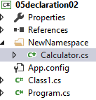
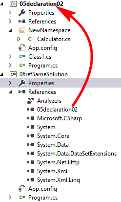

# C# Class

- [C# Class](#c-class)
    - [What is Class](#what-is-class)
    - [Class Declarations & inheirt & 3p](#class-declarations-inheirt-3p)

## What is Class

面向对象编程特征：

- 封装
- 继承
- 多态

```bash
#C#语言规范
C#类是一种数据结构，它可以包含：

- 数据成员(常量、字段)
- 函数成员(方法、属性、事件、索引器、运算符、实例构造函数、静态构造函数、析构函数)
- 嵌套类型

类支持继承，继承是一种机制，它使得派生类可以对基类进行扩展和专用化
```

```bash
#Timothy总结的Class的三个概念
Class是一种数据结构(data structure:抽象数据结构):
    Class本身是抽象过程的结果；Class同时作为抽象数据、抽象行为的载体；Class同时也是继承、多态的基础

Class是一种数据类型:
    Class是一种引用类型；具体到某一个类的时候，每一个类都是一个自定义类型，可以作为实例的模板

Class代表现实世界的模型：
```

GC: Garbage Collector,是高级编程语言(托管类编程语言)特色

```csharp
//Class是一种数据结构
using System;

namespace Chapter23_Class {
    class Program {
        static void Main(string[] args) {
            Student my1 = new Student() { ID = 1, Name = "grey" };
            Console.WriteLine(my1.ID);
            Console.WriteLine(my1.Name);
            my1.Report();

            Student my2 = new Student();
            Console.WriteLine(my2.ID);
            Console.WriteLine(my2.Name);
            my2.Report();

            Teacher myT1 = new Teacher(222, "James");
            Console.WriteLine(myT1.ID);
            Console.WriteLine(myT1.Name);
            myT1.Say();
        }
    }

    class Student {
        public int ID { get; set; }
        public String Name { get; set; }
        public void Report() {
            Console.WriteLine($"My ID is #{this.ID},my Name is {this.Name}.");
        }
    }

    class Teacher {
        //constructor,一般不写
        public Teacher(int id,string name) {
            this.ID = id;
            this.Name = name;
        }
        //destructor,一般不写
        ~Teacher() {
            Console.WriteLine("ByeBye"); 
        }
        public int ID { get; set; }
        public String Name { get; set; }
        public void Say()
        {
            Console.WriteLine($"I'm a Teacher, ID={ID},Name={Name}.");
        }
    }
}
```

```bash
#output
1
grey
My ID is #1,my Name is grey.
0

My ID is #0,my Name is .
222
James
I'm a Teacher, ID=222,Name=James.
ByeBye
Press any key to continue . . .
```

```csharp
//用反射创建实例，Class是一种数据类型
using System;

namespace _02csharpReflect {
    class Program {
        static void Main(string[] args) {
            Type t = typeof(Student);
            object o = Activator.CreateInstance(t,10,"Moris");
            Console.WriteLine(o.GetType().Name);//Student
            Console.WriteLine(o is Student);//True
            //找回类型
            Student my1 = o as Student;
            Console.WriteLine(my1.ID);
            Console.WriteLine(my1.Name);
            my1.Report();

            dynamic my2 = Activator.CreateInstance(t, 20, "Tom");
            Console.WriteLine(my2.ID);
            Console.WriteLine(my2.Name);
            my2.Report();
        }
    }

    class Student {
        public Student(int id,string name) {
            this.ID = id;
            this.Name = name;
        }
        public int ID { get; set; }
        public string Name { get; set; }
        public void Report() {
            Console.WriteLine($"I'm a teacher,ID={ID},name={Name}.");
        }
    }
}
```

```bash
#output
Student
True
10
Moris
I'm a teacher,ID=10,name=Moris.
20
Tom
I'm a teacher,ID=20,name=Tom.
```

```csharp
//Class是一种分类
using System;

namespace _03staticCtor {
    class Program {
        static void Main(string[] args) {
            Console.WriteLine(Student.Amount);
            Student my1 = new Student() { ID = 1, Name = "James" };
            Student my2 = new Student() { ID = 2, Name = "Chrie" };
            Console.WriteLine(Student.Amount);
        }
    }

    class Student {
        public static int Amount { get; set; }
        //静态构造器
        static Student() {
            Amount = 0;
        }

        public Student() {
            Amount++;
        }
        public int ID { get; set; }
        public String Name { get; set; }
        public void Report() {
            Console.WriteLine($"My ID is #{this.ID},my Name is {this.Name}.");
        }
    }
}
```

```bash
#output
0
2
```

## Class Declarations & inheirt & 3p

要说声明(delcare)了一个Class, 而说创建(create)一个instance(object)

Class declaration的位置：

- namespace中
- namespace外(项目里面绝对不会这么干)
- class中(成员类)

```csharp
//class declaration位置
using System;

namespace _04declaration {
    class Program {
        static void Main(string[] args) {
        }

        class China {
            //成员类
        }
    }

    class Student {
        public int ID { get; set; }
        public String Name { get; set; }
        public void Report() {
            Console.WriteLine($"My ID is #{this.ID},my Name is {this.Name}.");
        }
    }
}

namespace MyNamespace {
    class Teacher {
        public int ID { get; set; }
        public String Name { get; set; }
        public void Say() {
            Console.WriteLine($"I'm a Teacher, ID={ID},Name={Name}.");
        }
    }
}

//写项目的时候绝对不会这么干, global
class Computer {
    public int Id { get; set; }
    public string Name { get; set; }

}
```

**declare**(declaration) vs **define**(definition)

c/c++中的delcare和define不同:

- Add/Class/自动生成`.h`和`.cpp`文件，其中`.h`为声明，`.cpp`为定义
- 当然也可以将`.cpp`中的东西放到`.h`中，即声明和定义在一起

C#/Java中的declare即deine:

- Add/Class/自动生成`.cs`(声明即定义)



```csharp
//Program.cs
using System;

namespace _05declaration02 {
    class Program {
        static void Main(string[] args) {
        }
    }
}
```

```csharp
//Class1.cs
using System;

namespace _05declaration02 {
    class Class1 {
        //都在相同的namespace中
    }
}
```

visual studio会自动将新增的folder当作是一级namespace使用

```csharp
//Calculator.cs
using System;

namespace _05declaration02.NewNamespace {
    //没有public,默认是internal class Calculator
    public class Calculator {
       public double myAdd(double a,double b) {
            return a + b;
        }
    }
}
```

如果同一个solution要用05declaration02中的class Calculator，Add/Reference/选择project,这样过后，不能让**05declaration02**引用**06refSameSolution**(出现循环引用，vs报错)

上面的class Calculator必须是public才能给引用**06refSameSolution**使用



```csharp
//06refSameSolution中使用Method1
using System;

namespace _06refSameSolution {
    class Program {
        static void Main(string[] args) {
            _05declaration02.NewNamespace.Calculator myCalc = new _05declaration02.NewNamespace.Calculator();
            Console.WriteLine(myCalc.myAdd(10.0,12.5));//22.5
        }
    }
}
```

```csharp
//06refSameSolution中使用Method2
using System;
using _05declaration02.NewNamespace;

namespace _06refSameSolution {
    class Program {
        static void Main(string[] args) {
            Calculator myCalc = new Calculator();
            Console.WriteLine(myCalc.myAdd(10.0,12.5));//22.5
        }
    }
}
```

`internal class`表示，同一个项目的中的class是可以相互访问的(将class的访问限制在项目级别)

项目级别(project level):学名assembly(每一个project编译结果就是一个Assembly)

区别`internal class`与`private class`

- `internal class`修饰namespace中的class
- `private class`不能修饰namespace中的class，只能修饰class中的class