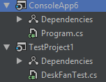
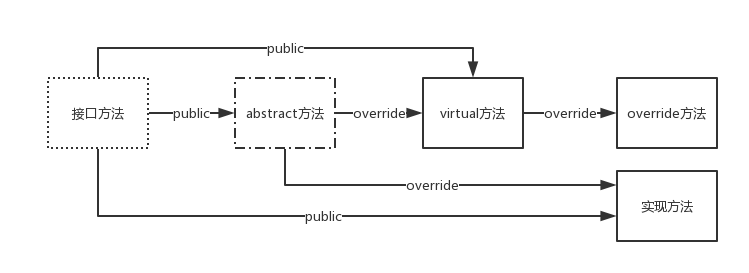

# Interface & Abstract Class

- [Interface & Abstract Class](#interface--abstract-class)
    - [Introduction](#introduction)
    - [Abstract Class](#abstract-class)
    - [Interface](#interface)
    - [Interface inversion & unit test](#interface-inversion--unit-test)
        - [unit test](#unit-test)

## Introduction

接口、抽象类是OOP中最精妙的部分

具体类(concrete class)→抽象类(abstract class)→接口(class): 越来越抽象，内部实现的东西越来越少;

重点:

- 接口与抽象类的区别，以及用法的不同
- 用接口与抽象类写的代码易于测试、维护

设计模式学习前提：要先学接口、抽象类; 了解了SOLID设计原则;

SOLID设计原则:

- SRP: Single Responsibility Principle, 单一职责原则
- OCP: Open-Closed Principle, 开放关闭原则
- LSP: Liskov substitution principle, Liskov替换原则
- ISP: Interface segregation principle, 接口隔离原则
- DIP: Dependnecy Inversion Principle, 依赖反转原则

由这5种Principles孕育了几十种设计模式;

## Abstract Class

一个class里面至少有一个没有被实现的method; 这个没有被实现的method必须用`abstract`修饰，同时所在的class由`abstract`修饰;

```csharp
using System;

namespace ConsoleApp1 {
    class Program {
        static void Main(string[] args) {
            Console.WriteLine("Hello World!");
        }
    }
    // 抽象类
    abstract class Student {
        abstract public void Study();
    }
}
```

抽象类的作用:

- 因为method没有被实现，所以抽象类不允许instantialize;
- 让子类继承, 在子类中实现`abstract` method;
- 用`abstract` class声明变量，然后引用子类的instance, 产生多态的效果;

Attention:

- `virtual`是有方法体的, 让子类`override`; 然而`abstract`连方法体都没有，其中的`abstract` method也叫做**纯虚方法**;
- 开闭原则: 将不变的成员封装，将会改变的成员声明成`abstract`

```csharp
// 违反开闭原则
using System;

namespace ConsoleApp1 {
    class Program {
        static void Main(string[] args) {
            Vehicle v=new Car();
            v.Run("car");
        }
    }

    class Vehicle {
        public void Stop() {
            Console.WriteLine("Stopped!");
        }

        // 这里违反了开闭原则，每次添加一种vehicle, 就要添加一句else if(){}
        public void Run(string type) {
            if (type == "car") {
                Console.WriteLine("Car is running...");
            }
            else if (type == "truck") {
                Console.WriteLine("Truck is running...");
            }
        }
    }

    class Car:Vehicle {
    }

    class Truck:Vehicle {
    }
}
```

```csharp
// 采用virtual
using System;

namespace ConsoleApp1 {
    class Program {
        static void Main(string[] args) {
            Vehicle v=new Car();
            v.Run();
        }
    }

    class Vehicle {
        public void Stop() {
            Console.WriteLine("Stopped!");
        }
        // 采用virtual+override
        public virtual void Run() {

        }
    }

    class Car:Vehicle {
        public override void Run() {
            Console.WriteLine("Car is running...");
        }
    }

    class Truck:Vehicle {
        public override void Run() {
            Console.WriteLine("Truck is running...");
        }
    }
}
```

```csharp
// 采用abstract class
//因为class Vehicle中的Run是空的方法体,干脆方法体也不要了, 所以直接进行abstract
using System;

namespace ConsoleApp1 {
    class Program {
        static void Main(string[] args) {
            Vehicle v=new Car();
            v.Run();
        }
    }

    abstract class Vehicle {
        public void Stop() {
            Console.WriteLine("Stopped!");
        }

        public abstract virtual void Run();
    }

    class Car:Vehicle {
        public override void Run() {
            Console.WriteLine("Car is running...");
        }
    }

    class Truck:Vehicle {
        public override void Run() {
            Console.WriteLine("Truck is running...");
        }
    }
}
```

```csharp
// 如果abstract class所有的method的都是`abstract`
using System;

namespace ConsoleApp1 {
    class Program {
        static void Main(string[] args) {
            Vehicle v = new Car();
            v.Run();
        }
    }
    
    // 纯虚类,也就是interface
    abstract class VehicleBase {
        public abstract void Stop();
        public abstract void Run();
    }

    abstract class Vehicle : VehicleBase {
        public override void Stop() {
            Console.WriteLine("Stopped!");
        }

        // 这个地方不能有public abstract void Run();
    }

    class Car : Vehicle {
        public override void Run() {
            Console.WriteLine("Car is running...");
        }
    }

    class Truck : Vehicle {
        public override void Run() {
            Console.WriteLine("Truck is running...");
        }
    }
}
```

```csharp
// 如果abstract class所有的method的都是`abstract`, 那么就是纯虚类, 也就是interface
using System;

namespace ConsoleApp1 {
    class Program {
        static void Main(string[] args) {
            Vehicle v = new Car();
            v.Run();
        }
    }

    // abstract class VehicleBase {
    //     public abstract void Stop();
    //     public abstract void Run();
    // }

    // 上面写法太繁琐
    // abstract class把上面的简写interface;
    // 并且interface的method默认就是public, 默认是abstract,所以简写
    // 而且interface里面只有method;
    interface VehicleBase{
        void Stop();
        void Run();
    }

    // 下面的override也要去掉
    abstract class Vehicle : VehicleBase {
        // abstract 中的override要省略
        public void Stop() {
            Console.WriteLine("Stopped!");
        }
        // abstract的方法要拿下了
        public abstract void Run();
    }

    class Car : Vehicle {
        public override void Run() {
            Console.WriteLine("Car is running...");
        }
    }

    class Truck : Vehicle {
        public override void Run() {
            Console.WriteLine("Truck is running...");
        }
    }
}
```

interface的解耦功能比abstract class的更强;

Summary:

- `abstract class`为作为基类而生;
- `interface`为解耦而生;

关于内部的method:

- `interface`中的method必须是`public`(隐式)
- `abstract class`中的method不能是`private`(`protected`, `internal`)

## Interface

接口可以理解为：协约

接口的作用：使自由合作成为可能; 即约束服务的使用者，也约束服务的提供者; 如果多个使用者、提供者实现了同一个接口，那么可以自由地组合;

```csharp
// 关于interface的简单例子
using System;
using System.Collections;

namespace ConsoleApp2 {
    class Program {
        static void Main(string[] args) {
            // int[]的基类是Array,实现了IEnumerable
            int[] nums1 = new[] {1, 2, 3, 4, 5, 6};
            // ArrayList每一个元素都是object;
            ArrayList nums2 = new ArrayList {1, 2, 3, 4, 5, 6};
            // int[]和ArrayList都实现了IEnumerable
            // 提供方nums1, nums2; 需求方Sum, Avg
            Console.WriteLine(Sum(nums1));
            Console.WriteLine(Avg(nums1));
            Console.WriteLine("==========");
            Console.WriteLine(Sum(nums2));
            Console.WriteLine(Avg(nums2));
        }

        static int Sum(IEnumerable nums) {
            int sum = 0;
            foreach (var num in nums) sum += (int) num;
            return sum;
        }

        static double Avg(IEnumerable nums) {
            int sum = 0;
            double count = 0;
            foreach (var num in nums) {
                sum += (int) num;
                count++;
            }

            return sum / count;
        }
    }
}
```

抽象世界中的分工、合作：是class与class间的分工、合作; 合作也叫做依赖, 依赖越直接，耦合越紧;

```csharp
// 紧耦合
using System;

namespace ConsoleApp3 {
    class Program {
        static void Main(string[] args) {
            var engine = new Engine();
            var car = new Car(engine);
            // car与engine紧耦合，如何engine出现了问题, engine没有出现问题，也无法执行
            car.Run(3);
            Console.WriteLine(car.Speed);
        }
    }

    class Engine {
        public int RPM { get; private set; }

        public void Work(int gas) {
            this.RPM = 1000 * gas;
        }
    }

    class Car {
        private Engine _engine;

        public Car(Engine engine) {
            _engine = engine;
        }

        public int Speed { get; private set; }

        public void Run(int gas) {
            _engine.Work(gas);
            this.Speed = _engine.RPM / 100;
        }
    }
}
```

```csharp
// 引入interface, 降低耦合度
using System;

namespace ConsoleApp4 {
    class Program {
        static void Main(string[] args) {
            var nokia = new NokiaPhone();
            var mi5 = new XiaomiPhone();
            var user1 = new PhoneUser(nokia);
            user1.UsePhone();
            Console.WriteLine("=========");
            var user2 = new PhoneUser(mi5);
            user2.UsePhone();
        }
    }

    class PhoneUser {
        private IPhone _phone;

        public PhoneUser(IPhone phone) {
            _phone = phone;
        }

        public void UsePhone() {
            _phone.Dial();
            _phone.Answer();
            _phone.Send();
            _phone.Receive();
        }
    }

    interface IPhone {
        //作为Phone的interface, 不是iPhone手机
        void Dial();
        void Answer();
        void Receive();
        void Send();
    }

    class NokiaPhone : IPhone {
        public void Dial() {
            Console.WriteLine("Nokia calling...");
        }

        public void Answer() {
            Console.WriteLine("Hello, This is Grey");
        }

        public void Receive() {
            Console.WriteLine("Nokia Received");
        }

        public void Send() {
            Console.WriteLine("From Nokia");
        }
    }

    class XiaomiPhone : IPhone {
        public void Dial() {
            Console.WriteLine("Xiaomi calling...");
        }

        public void Answer() {
            Console.WriteLine("Hello, this is Grey");
        }

        public void Receive() {
            Console.WriteLine("Xiaomi Received");
        }

        public void Send() {
            Console.WriteLine("From Xiaomi");
        }
    }
}
```

引入`reflection`可以进一步降低耦合度;

## Interface inversion & unit test

主要是SOLID中的D: 依赖反转原则;

解耦在代码中表现就是依赖反转, 单元测试是依赖反转在开发中的直接应用和直接受益者;

当一个class实现了一个interface, 该class与interface就是紧耦合的；

```csharp
// 不引入interface，进行测试
using System;

namespace ConsoleApp5 {
    class Program {
        static void Main(string[] args) {
            var fan = new DeskFan(new PowerSupply());
            Console.WriteLine(fan.Work());
        }
    }

    class PowerSupply {
        public int GetPower() {
            // 测试电扇的时候要去不断修改PowerSupply这个class的110; 而且可能有其他的class也要用这个class
            // 引入interface, 就可以进行单元测试
            return 110;
        }
    }

    class DeskFan {
        private PowerSupply _powerSupply;

        public DeskFan(PowerSupply powerSupply) {
            _powerSupply = powerSupply;
        }

        public string Work() {
            int power = _powerSupply.GetPower();
            if (power <= 0) {
                return "won't work";
            }
            else if (power < 100) {
                return "work slow";
            }
            else if (power < 200) {
                return "work fine";
            }
            else {
                return "warning!!!";
            }
        }
    }
}
```

设计接口的方式:

- 自底向上(重构): 一般程序员
- 自顶向下(设计): CTO

### unit test



```csharp
// 待测试
using System;

namespace ConsoleApp6 {
    class Program {
        static void Main(string[] args) {

        }
    }

    // 为了让其他assembly看到加上public
    public interface IPowerSupply {
        int GetPower();
    }

    public class PowerSupply : IPowerSupply {
        public int GetPower() {
            return 110;
        }
    }

    public class DeskFan {
        private IPowerSupply _powerSupply;

        public DeskFan(IPowerSupply powerSupply) {
            _powerSupply = powerSupply;
        }

        public string Work() {
            int power = _powerSupply.GetPower();
            if (power <= 0) {
                return "won't work";
            }
            else if (power < 100) {
                return "work slow";
            }
            else if (power < 200) {
                return "work fine";
            }
            else {
                return "warning!!!";
            }
        }
    }
}
```

```csharp
// unit test
using System;
using ConsoleApp6;
using Xunit;

namespace TestProject1 {
    public class DeskFanTest {
        [Fact]
        public void PowerLowerThanZero_OK() {
            var fan = new DeskFan(new PowerLowerThanZero());
            var expected = "won't work";
            var actual = fan.Work();
            Assert.Equal(expected, actual);
        }

        [Fact]
        public void PowerHigherThan200_OK() {
            var fan = new DeskFan(new PowerHigherThan200());
            var expected = "warning!!!";
            var actual = fan.Work();
            Assert.Equal(expected, actual);
        }
    }

    // 测试用的powerSupply
    class PowerLowerThanZero : IPowerSupply {
        public int GetPower() {
            return 0;
        }
    }

    class PowerHigherThan200 : IPowerSupply {
        public int GetPower() {
            return 220;
        }
    }
}
```

改进的unit test: 使用Nuget中的Moq

```csharp
// mock modified
using System;
using ConsoleApp6;
using Xunit;
using Moq;

namespace TestProject1 {
    public class DeskFanTest {
        [Fact]
        public void PowerLowerThanZero_OK() {
            var mock = new Mock<IPowerSupply>();
            mock.Setup(ps => ps.GetPower()).Returns(() => 0);
            var fan = new DeskFan(mock.Object);
            var expected = "won't work";
            var actual = fan.Work();
            Assert.Equal(expected, actual);
        }

        [Fact]
        public void PowerHigherThan200_OK() {
            var mock = new Mock<IPowerSupply>();
            mock.Setup(ps => ps.GetPower()).Returns(() => 220);
            var fan = new DeskFan(mock.Object);
            var expected = "warning!!!";
            var actual = fan.Work();
            Assert.Equal(expected, actual);
        }
    }
}
```

summary:

